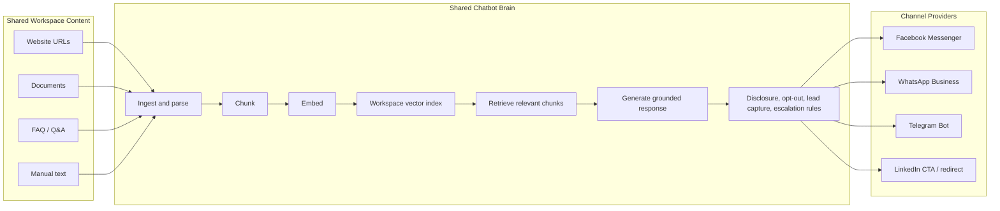
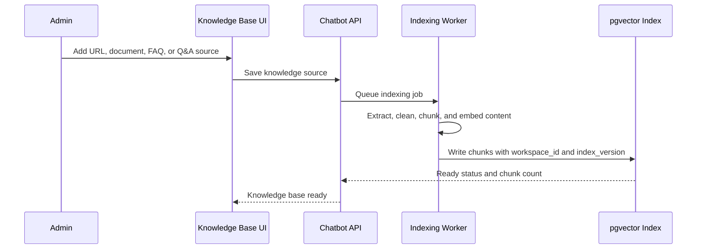
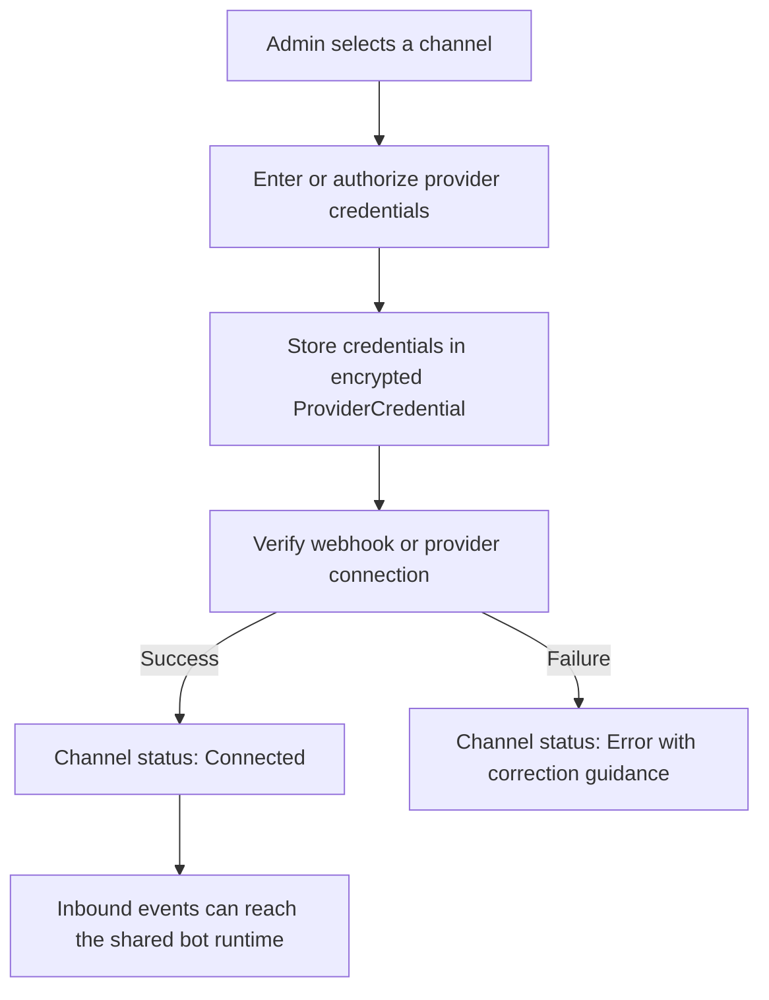
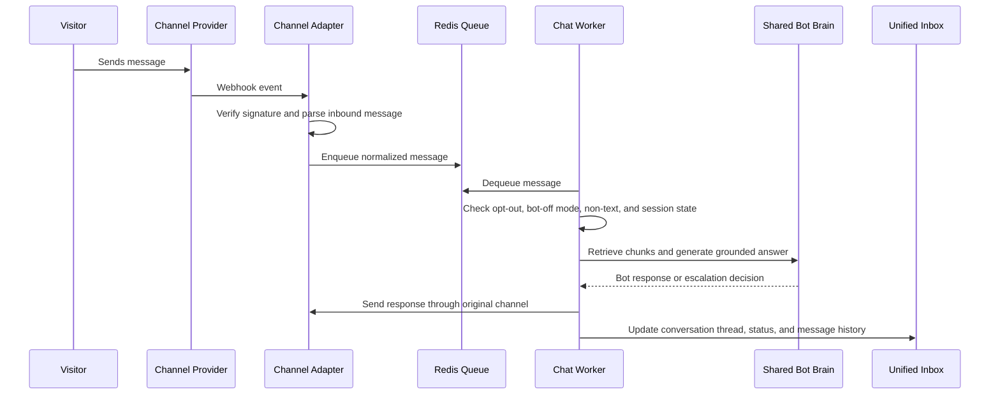
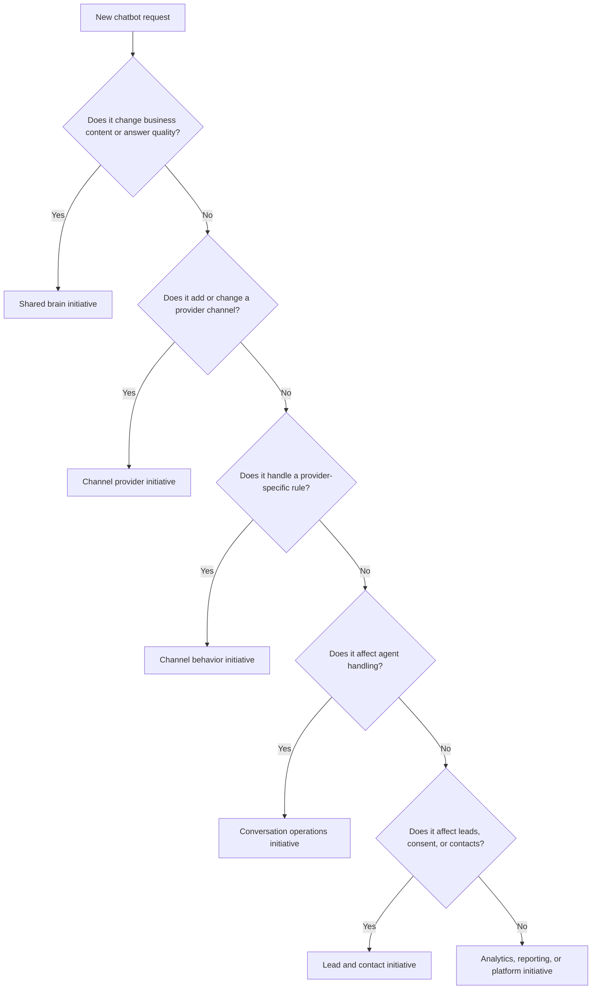

# ChatBot Hub Effort Flow Guide

## Purpose

This guide explains how a ChatBot Hub initiative works when the business wants the same chatbot knowledge available across multiple customer channels.

The core rule is simple:

> One workspace knowledge base feeds one shared bot brain. Each channel provider is only an entry, delivery, compliance, and identity adapter around that same brain.

That means Facebook Messenger, WhatsApp Business, Telegram, and future channels do not each get their own separate content library. They share the same indexed business content, retrieval pipeline, bot policies, handoff model, and reporting foundation. The initiative is classified by channel because each provider has different connection, webhook, delivery, and policy requirements.

## Core Model



## Initiative Classification

Classify every chatbot request into one of these buckets before estimating or planning implementation.

| Classification | What changes | What stays shared | Examples |
|---|---|---|---|
| Shared brain initiative | Knowledge ingestion, indexing, retrieval, grounding, Test Bot | All channels use the same output | Add document upload, improve chunking, add source citations |
| Channel provider initiative | Provider credential flow, webhook verification, inbound parsing, outbound send | Knowledge base, RAG, bot policy, inbox, analytics | Connect WhatsApp Cloud API, add Telegram Bot API |
| Channel behavior initiative | Channel-specific rules, UX copy, delivery constraints, visitor identity handling | Core answer generation and source content | WhatsApp 24-hour window, Meta AI disclosure, Telegram opt-out mapping |
| Conversation operations initiative | Inbox, escalation, agent reply, resolution, export | Channel origin is metadata on the same thread model | Unified inbox filters, escalation notifications, conversation export |
| Lead and contact initiative | Intent capture, consent, contact upsert, tags, handoff packet | Lead capture rules run after any channel conversation | Create `chatbot-lead`, update existing contact, record consent |
| Analytics initiative | Metrics, snapshots, channel breakdown, containment rate | Events are normalized into the same analytics model | WhatsApp lead conversion, Facebook containment rate |

## Channel Classification Matrix

| Channel | Provider / mechanism | Initiative type | Shared content use | Channel-specific work | MVP posture |
|---|---|---|---|---|---|
| Facebook Page Messenger | Meta Messenger Platform webhook | Real-time inbound chat channel | Uses the same workspace vector index and bot prompt | Meta webhook challenge, HMAC signature, Page token, sender ID normalization, AI disclosure | MVP required |
| WhatsApp Business | Meta WhatsApp Cloud API webhook | Real-time inbound chat channel with stricter policy rules | Uses the same workspace vector index and bot prompt | Phone number ID, access token, HMAC signature, 24-hour customer service window, phone visitor identity, STOP handling | MVP required |
| Telegram Bot | Telegram Bot API webhook or polling | Real-time inbound chat channel | Uses the same workspace vector index and bot prompt | Bot token, secret token verification, chat ID normalization, non-text fallback | MVP optional |
| LinkedIn | CTA, lead form, or redirect to WhatsApp / web page | Entry-point or lead-routing channel, not real-time bot in MVP | Routes visitor into an existing shared bot channel or lead capture path | Deep link, campaign attribution, source tracking | MVP link-only |
| Instagram Direct | Meta Instagram Messaging API | Future real-time channel | Would use the same workspace vector index and bot prompt | Provider approval, webhook events, media handling, identity mapping | Post-MVP |
| Web chat widget | First-party embedded widget | Future owned channel | Would use the same workspace vector index and bot prompt | Widget auth, session cookie, embed script, visitor identity | Post-MVP option |

## End-To-End Flow

### 1. Build The Shared Knowledge Base



Important behavior:

- The workspace owns one active knowledge index.
- Re-indexing creates a new `index_version`.
- Active conversations stay pinned to their current index version until the session ends.
- New conversations use the latest ready index.

### 2. Connect A Channel Provider



Channel connection is classified as provider work. It should not duplicate the knowledge base, bot prompt, inbox model, or analytics model.

### 3. Receive A Visitor Message



The adapter is channel-specific. The worker and brain are shared.

### 4. Answer From The Same Content

For every supported channel, answer generation follows the same pattern:

1. Normalize the inbound visitor message.
2. Resolve `workspace_id`, `channel`, and `visitor_id`.
3. Load the conversation session.
4. Retrieve top matching chunks from the workspace index.
5. Construct the prompt with persona, disclosure, source chunks, and history.
6. Generate the answer with the configured LLM.
7. Send the response back through the originating channel adapter.
8. Record the turn in the unified conversation thread.

The only channel-specific parts are provider identity, payload parsing, delivery API, platform constraints, and compliance wording.

## Shared Brain Versus Channel Edge

| Capability | Shared brain responsibility | Channel edge responsibility |
|---|---|---|
| Knowledge content | Source ingestion, chunking, embeddings, retrieval | None, except linking channel to workspace |
| Bot answer | Grounded response, no hallucination rule, token budget | Send answer in provider-supported format |
| AI disclosure | Enforce disclosure in prompt and output policy | Include required wording for provider rules |
| Visitor identity | Store normalized visitor identity on conversation | Convert provider sender ID into normalized visitor ID |
| Opt-out | Stop bot automation and audit event | Detect provider-specific STOP / unsubscribe text |
| Non-text handling | Decide fallback response | Detect images, files, voice notes, stickers, locations |
| Human handoff | Thread status, inbox visibility, escalation reason | Deliver agent reply through original provider |
| Analytics | Aggregate normalized conversation and outcome events | Provide channel label and delivery status |

## Flow By Initiative Type

### Shared Brain Initiative Flow

Use this when the request changes what the bot knows or how it answers.

```text
Knowledge source request
  -> Source model and admin UI
  -> Ingestion worker
  -> Chunking and embedding
  -> Workspace vector index
  -> Test Bot validation
  -> Runtime retrieval
  -> Release with no channel-specific duplication
```

Typical acceptance checks:

- Source can be added, edited, deleted, and re-indexed.
- Retrieved chunks are scoped to the workspace.
- Test Bot shows answer plus source evidence.
- Existing connected channels automatically benefit after re-index.

### Channel Provider Initiative Flow

Use this when the request adds or changes a customer entry channel.

```text
Channel request
  -> Credential requirements
  -> Provider adapter
  -> Webhook verification
  -> Event normalization
  -> Outbound send implementation
  -> Channel status UI
  -> Shared bot runtime integration
  -> Inbox, analytics, opt-out, and escalation coverage
```

Typical acceptance checks:

- Invalid webhook signatures are rejected.
- Duplicate provider messages are deduplicated.
- Inbound text reaches the shared chat worker.
- Outbound bot and agent replies return through the same channel.
- Channel appears in unified inbox filters and analytics.

### Channel Behavior Initiative Flow

Use this when the request changes behavior for a specific channel, without changing the shared brain.

```text
Provider rule or UX request
  -> Identify affected channel
  -> Add adapter or policy guard
  -> Surface state in UI when needed
  -> Add regression tests
  -> Confirm shared runtime still works for all channels
```

Examples:

- WhatsApp reply input is disabled after the 24-hour window expires.
- Facebook and WhatsApp bot messages include AI identity disclosure.
- Telegram receives a graceful fallback for stickers or files.
- LinkedIn CTA routes to WhatsApp instead of starting a real-time LinkedIn bot.

## Decision Tree

Use this decision tree to classify new requests quickly.



## Example Initiatives

| Request | Classification | Why |
|---|---|---|
| Add PDF ingestion to the bot | Shared brain initiative | Every channel should answer from the uploaded PDF |
| Add WhatsApp Business support | Channel provider initiative | New provider credentials, webhook, parser, and send path are needed |
| Block WhatsApp agent replies after 24 hours | Channel behavior initiative | The rule applies only to WhatsApp delivery |
| Add a real-time escalation inbox badge | Conversation operations initiative | It affects shared operator handling across all channels |
| Create contacts from demo requests | Lead and contact initiative | It depends on conversation intent, not the provider itself |
| Show conversion rate by channel | Analytics initiative | It uses normalized events grouped by channel |
| Add LinkedIn support for MVP | Channel provider classification: entry-point only | MVP uses LinkedIn as a redirect or lead source, not a live bot channel |

## Shared Content Governance

Because all channels answer from the same knowledge base, content governance must happen once at the workspace level.

| Governance area | Rule |
|---|---|
| Source ownership | Admin owns URLs, documents, FAQ, and Q&A sources for the workspace |
| Workspace isolation | Every source, chunk, thread, and metric is scoped by `workspace_id` |
| Index readiness | A channel should not be activated until the workspace has at least one ready knowledge index |
| In-flight consistency | Active sessions stay on their pinned index version |
| Testing | Test Bot validates answers before channel activation |
| Auditability | Re-index, source changes, opt-out, lead consent, export, and provider credential changes are audit-relevant |

## Operating States

| State | Meaning | Operator impact |
|---|---|---|
| No knowledge | Channel can be connected, but bot should not go live without content | Admin adds content and indexes |
| Knowledge indexing | Content is being processed | Admin waits or continues setup; Test Bot may use last ready index |
| Knowledge ready | Shared brain can answer | Channels can be activated |
| Channel disconnected | Provider is not configured | No inbound events for that channel |
| Channel connected inactive | Credentials exist, bot is not active | Admin can activate when ready |
| Channel connected active | Provider can send inbound events to bot | Visitor messages are processed |
| Bot active thread | Bot is handling conversation | Agent can monitor |
| Escalated thread | Bot needs human help | Agent should reply from inbox |
| Agent active thread | Human has taken over | Bot stays quiet until resolved or re-enabled |
| Resolved thread | Conversation is closed | Analytics keeps outcome |
| Opted-out thread | Visitor requested no bot automation | Bot stays off unless re-consent is confirmed |

## Delivery Order

Recommended order for a new channel initiative:

1. Confirm the shared knowledge base and Test Bot path work.
2. Add or verify the channel credential model.
3. Build the channel adapter and webhook verification.
4. Normalize inbound messages into the shared message schema.
5. Send outbound bot replies through the provider.
6. Add channel status UI.
7. Add inbox filter, analytics breakdown, opt-out handling, and compliance states.
8. Run shared-brain tests plus channel-specific webhook and delivery tests.

Recommended order for a shared brain initiative:

1. Add or update source management.
2. Update ingestion and indexing.
3. Verify retrieval against the workspace index.
4. Validate through Test Bot.
5. Confirm existing channel responses improve without channel-specific changes.
6. Add release checks for hallucination, workspace isolation, and source evidence.

## Release Readiness Checklist

- [ ] The workspace has at least one ready knowledge index.
- [ ] Test Bot returns grounded answers with source evidence.
- [ ] Each active channel has verified credentials and webhook security.
- [ ] Every inbound provider event is normalized into the shared message schema.
- [ ] Bot responses include AI disclosure.
- [ ] Opt-out is checked before RAG or LLM work.
- [ ] Non-text messages receive channel-safe fallback.
- [ ] Escalations appear in the unified inbox.
- [ ] Agent replies return through the originating channel.
- [ ] WhatsApp-specific 24-hour window rules are enforced where applicable.
- [ ] Lead capture records consent before collecting PII.
- [ ] Analytics can break down conversations, leads, escalations, and opt-outs by channel.
- [ ] Cross-workspace isolation tests cover knowledge, conversations, opt-outs, and analytics.

## Practical Summary

ChatBot Hub should be planned as a shared intelligence platform with channel-specific edges.

- Build content once.
- Index it once per workspace.
- Test it once through Test Bot.
- Connect multiple providers around it.
- Normalize every conversation into one inbox, one contact pool, and one analytics model.

When a new request arrives, classify it by what changes: the shared brain, the provider edge, provider-specific behavior, operations, leads, or analytics. That classification keeps the effort clear and prevents duplicate bot brains from appearing per channel.
