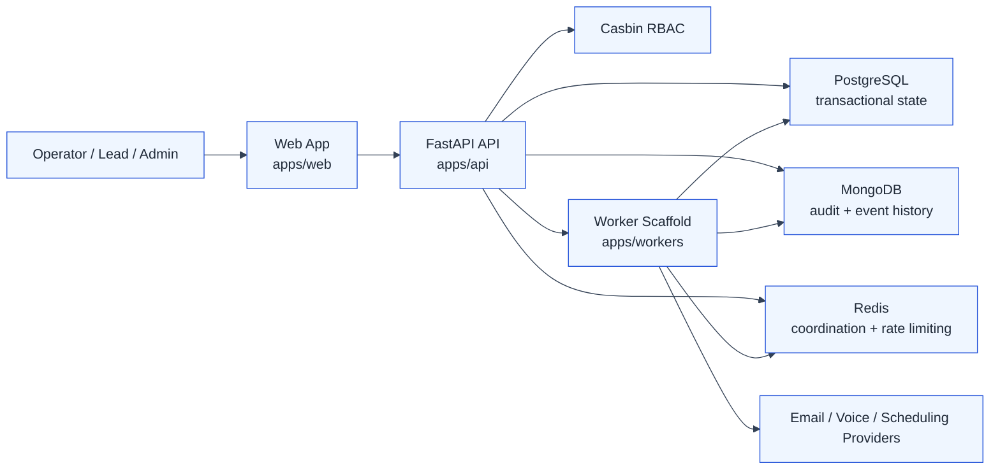

# EngageHub Architecture Overview

This section documents the current EngageHub architecture as it exists in the repository on 2026-04-02, with BMAD planning context called out where the implementation is still forming.

Use these documents together:

- [Architecture Stories](./architecture-stories.md) explains the system in narrative form, organized by business capability and technical boundary.
- [Data Model](./data-model.md) describes the PostgreSQL, MongoDB, and Redis responsibilities with a GitHub-renderable Mermaid ERD.
- [Process Flows](./process-flows.md) walks through the main request, approval, policy, and delivery-pipeline flows with sequence and swimlane diagrams.
- [Validation Report (2026-04-02)](./validation-report-2026-04-02.md) compares architecture docs to planning artifacts and current implementation status.
- [Draw.io Diagram Source](./diagrams/system-context.drawio) provides editable source for architecture visuals in the draw.io extension.

## System Snapshot

- `apps/api` is the active system core. It exposes FastAPI endpoints for campaigns, templates, offer packs, policies, approvals, controls, login, users, and health utilities.
- `apps/web` is the operator console. It contains route shells and feature pages for campaigns, templates, governance, and admin workflows.
- `apps/workers` is a lightweight worker scaffold today. The Epic 2 foundation tables and worker gate logic show the intended asynchronous delivery direction, but the full dequeue-and-deliver loop is not implemented yet.
- `packages/event-contracts` and `packages/shared-types` are the beginning of the shared contract layer.
- `_bmad-output/planning-artifacts` contains product, UX, and architecture planning material that informs the target-state design.

## Architecture At A Glance

## Validation Snapshot (Planning vs Implementation)

| Capability Area | Planning Baseline | Current Evidence | Validation Status |
| --- | --- | --- | --- |
| Campaign intake and segmentation | Epic 1 / Story 1.2 | API endpoints + domain tests + Playwright additions; story tracked as `review` in sprint status | Partial-complete |
| Template/token/offer-pack governance | Epic 1 / Story 1.3 | Backend and domain tests exist; UI automation remains open | Partial-complete |
| Governance controls and approvals | Epic 1 / Story 1.4 | Policy engine, approvals, pause/resume routes, worker gate, tests; API test stability still tracked | Partial-complete |
| Delivery pipeline runtime loop | Epic 2 / Stories 2.1-2.4 | Foundation schema/services present (`outbox`, `action_queue`, progression), full dequeue/provider loop not complete | In-progress |
| Timeline/KPI observability | Epic 5 | Core audit/event scaffolding present; full KPI surfaces remain backlog | Planned |

Legend:

- `Partial-complete`: major implementation exists with pending closure items.
- `In-progress`: schema/service foundations exist, but end-to-end operational loop is incomplete.
- `Planned`: documented in planning artifacts, not yet fully implemented.

## Current-State Architectural Themes

### 1. Governed orchestration comes before delivery automation

The repo already prioritizes campaign setup, template governance, approvals, and pause or resume controls. That tells us the product treats operational safety as a first-class concern, not an afterthought.

### 2. Request context is part of the contract

Most mutation endpoints require both `X-Workspace-Id` and `Idempotency-Key`. Correlation IDs are also propagated through middleware. This creates a stable foundation for auditability and future async execution.

### 3. Persistence is intentionally split by responsibility

PostgreSQL carries mutable business state, MongoDB stores append-oriented audit and event documents, and Redis is reserved for ephemeral coordination. The split is visible in code and in the latest Epic 2 migration.

### 4. The worker architecture is emerging, not finished

The presence of `outbox_events`, `action_queue`, `provider_credentials`, `provider_event_logs`, and the worker enforcement gate signals a clear target architecture. The docs in this folder treat that as an in-progress implementation path, not a completed subsystem.

## Reading Order

If you are new to the codebase, read in this order:

1. [Architecture Stories](./architecture-stories.md)
2. [Data Model](./data-model.md)
3. [Process Flows](./process-flows.md)
4. [Validation Report (2026-04-02)](./validation-report-2026-04-02.md)
