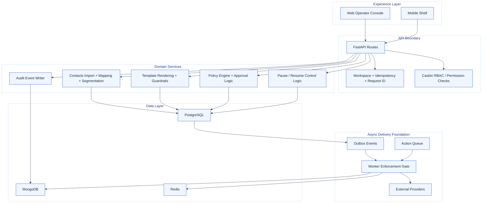

# EngageHub Architecture Stories

This document explains the architecture as a set of stories. Each story ties business intent to code structure so the repo remains understandable as it grows.

## Story 1: The API is the operational control plane

The FastAPI application in `apps/api` is the center of gravity for the product. It accepts operator intent, validates tenant and request context, enforces RBAC, persists state to PostgreSQL, and writes audit records to MongoDB.

That pattern is visible across the main feature routes:

- `campaigns` owns campaign creation, CSV import, mapping preview, segment estimation, and strategy assignment.
- `templates` owns template creation, versioning, preview, and publish-time guardrail validation.
- `policies` owns policy CRUD and policy evaluation.
- `approvals` owns submission, approval, and rejection flows.
- `controls` owns global and campaign-level pause and resume behavior.

The API also establishes the platform-wide request contract:

- `X-Workspace-Id` is mandatory for tenant scoping.
- `Idempotency-Key` is mandatory for mutating requests.
- `X-Request-Id` or `X-Correlation-Id` is accepted and propagated when present.

## Story 2: Governance is built into the normal path

EngageHub does not bolt governance on later. It makes governance part of the happy path.

Examples:

- Template publishing runs through `validate_template(...)` before a version can become `published`.
- Policy creation validates payload structure before persistence.
- Approval requests auto-approve only when the action does not exceed the policy threshold logic in `requires_approval(...)`.
- Pause and resume controls are modeled explicitly in `global_control_state` and mirrored by the worker-side `EnforcementGate`.

That means product operators are not just sending messages. They are configuring a governed system with safety rails, escalation routes, and audit evidence.

## Story 3: PostgreSQL holds the mutable workflow backbone

The SQLModel layer shows a clear operational data model:

- Campaign setup and contact intake live in campaign, import, staging, segment, and strategy tables.
- Template and offer pack authoring live in versioned library tables.
- Policy and approval workflows live in governance and approval tables.
- Epic 2 adds contact progression, action queue, outbox, and provider credential tables for reliable delivery orchestration.

The overall shape is practical: relational storage handles ownership, scoping, versioning, uniqueness, and queryable operational state very well.

## Story 4: MongoDB is the system memory

MongoDB is used for append-friendly event and audit records:

- `audit_events` receives activity emitted by API routes such as campaign creation, policy creation, and approval actions.
- `event_store` is documented as the contact lifecycle event log.
- `contact_timeline` is documented as a denormalized read model for contact activity history.

This is a good fit for high-cardinality payloads, evolving event shapes, and timeline-style reads that should not distort the relational model.

## Story 5: The worker is a deliberate next step, not a vague future wish

The current worker implementation is still light, but the repository already encodes the intended architecture:

- `outbox_events` supports reliable publishing from transactional changes.
- `action_queue` holds deferred outbound work.
- `provider_event_logs` normalizes webhook intake from external providers.
- `provider_credentials` establishes per-workspace provider configuration.
- `EnforcementGate` gives workers a central pause and campaign-stop decision point.

That tells a coherent story: the API authors intent and state, while workers execute side effects safely and continuously.

## Story 6: Authorization is layered, not one-dimensional

The authorization model combines:

- authenticated user identity from the starter auth stack,
- role minimums through `require_role(...)`, and
- fine-grained route permission checks through Casbin with `require_permission(...)`.

This is important because the product has distinct human roles:

- operators prepare and run campaigns,
- leads govern templates and review approvals,
- admins manage policy and controls,
- super admins retain top-level override authority.

## Story 7: The product is moving toward event-aware orchestration

The Epic 2 schema introduces more than new tables. It introduces a stronger architecture style:

- state progression is explicit,
- state changes are historically recorded,
- work is queued,
- side effects are prepared for async processing,
- provider responses are normalized.

That is the start of an event-aware orchestration model, even though the end-to-end delivery engine is not fully wired yet.

## Component Map

## Implementation Status Notes

The repo is strong on setup, governance, and schema direction. It is lighter on completed delivery execution. That is not a flaw in the docs; it is the current state of the product.

A good mental model is:

- Today: governed campaign orchestration platform with strong operational controls.
- Next: fully wired async outbound delivery and provider feedback processing.
