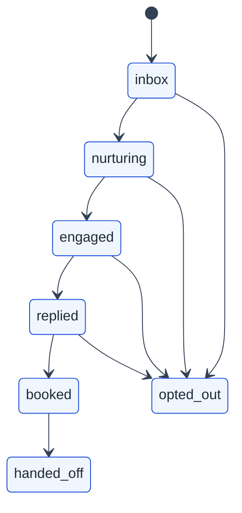

# EngageHub Data Model

EngageHub uses a polyglot persistence model:

- PostgreSQL stores mutable business state and transactional relationships.
- MongoDB stores append-oriented audit and event history.
- Redis is reserved for coordination, rate limiting, and short-lived operational state.

## Data Ownership

| Store | Responsibility | Examples |
| --- | --- | --- |
| PostgreSQL | Source of truth for operational records | campaigns, templates, approvals, policies, contact progression, action queue |
| MongoDB | Audit log and event history | `audit_events`, `event_store`, `contact_timeline` |
| Redis | Ephemeral coordination | rate limiting, pause state fan-out, future worker coordination |

## Core PostgreSQL Domains

### Campaign Intake

- `campaigns`
- `campaign_contact_imports`
- `campaign_contact_staging`
- `campaign_segments`
- `campaign_segment_rules`
- `campaign_channel_strategy`

These tables support campaign creation, CSV import, mapping, preview, segmentation, and strategy assignment.

### Template and Offer Library

- `templates`
- `template_versions`
- `template_tokens`
- `offer_packs`
- `offer_pack_versions`
- `offer_pack_template_bindings`

These tables implement a versioned content library with publish-state tracking and guardrail compliance.

### Governance and Approvals

- `governance_policies`
- `campaign_policy_bindings`
- `policy_approval_requests`
- `global_control_state`

These tables support admin policy management, approval workflows, and emergency stop style controls.

### Delivery Pipeline Foundation

- `contacts`
- `contact_progression`
- `contact_state_history`
- `outbox_events`
- `action_queue`
- `provider_credentials`
- `provider_event_logs`

These tables were introduced in the Epic 2 migration and represent the backbone of the future delivery engine.

## Mermaid ERD

```mermaid
%%{init: {"theme": "base", "themeVariables": {"primaryColor": "#EFF6FF", "primaryTextColor": "#1F2937", "primaryBorderColor": "#1D4ED8", "lineColor": "#334155", "secondaryColor": "#F3F4F6", "secondaryTextColor": "#1F2937", "tertiaryColor": "#DBEAFE", "tertiaryTextColor": "#1E3A8A", "background": "#F9FAFB", "clusterBkg": "#FFFFFF", "clusterBorder": "#BFDBFE", "fontFamily": "Inter, Segoe UI, sans-serif"}}}%%
erDiagram
    CAMPAIGNS ||--o{ CAMPAIGN_CONTACT_IMPORTS : has
    CAMPAIGNS ||--o{ CAMPAIGN_CONTACT_STAGING : stages
    CAMPAIGNS ||--o{ CAMPAIGN_SEGMENTS : groups
    CAMPAIGN_SEGMENTS ||--o{ CAMPAIGN_SEGMENT_RULES : defines
    CAMPAIGNS ||--o| CAMPAIGN_CHANNEL_STRATEGY : uses

    TEMPLATES ||--o{ TEMPLATE_VERSIONS : versions
    TEMPLATES ||--o{ TEMPLATE_TOKENS : tokenizes
    OFFER_PACKS ||--o{ OFFER_PACK_VERSIONS : versions
    OFFER_PACK_VERSIONS ||--o{ OFFER_PACK_TEMPLATE_BINDINGS : binds
    TEMPLATE_VERSIONS ||--o{ OFFER_PACK_TEMPLATE_BINDINGS : included_in
    OFFER_PACKS ||--o{ CAMPAIGN_CHANNEL_STRATEGY : assigned_to

    CAMPAIGNS ||--o{ GOVERNANCE_POLICIES : scoped_to
    CAMPAIGNS ||--o{ CAMPAIGN_POLICY_BINDINGS : linked_to
    GOVERNANCE_POLICIES ||--o{ CAMPAIGN_POLICY_BINDINGS : attached_by
    CAMPAIGNS ||--o{ POLICY_APPROVAL_REQUESTS : requests
    CAMPAIGNS ||--o{ GLOBAL_CONTROL_STATE : controls

    CONTACTS ||--o{ CONTACT_PROGRESSION : progresses
    CAMPAIGNS ||--o{ CONTACT_PROGRESSION : tracks
    CONTACTS ||--o{ CONTACT_STATE_HISTORY : records
    CAMPAIGNS ||--o{ CONTACT_STATE_HISTORY : records
    CONTACTS ||--o{ ACTION_QUEUE : queues
    CAMPAIGNS ||--o{ ACTION_QUEUE : queues

    CAMPAIGNS {
        uuid id PK
        string workspace_id
        string name
        string status
        uuid created_by
    }
    CAMPAIGN_CONTACT_IMPORTS {
        uuid id PK
        uuid campaign_id FK
        string source_file_name
        int total_rows
        int valid_rows
        int invalid_rows
    }
    CAMPAIGN_CONTACT_STAGING {
        uuid id PK
        uuid campaign_id FK
        uuid import_id FK
        string workspace_id
        bool is_valid
    }
    CAMPAIGN_SEGMENTS {
        uuid id PK
        uuid campaign_id FK
        string workspace_id
        string name
        int estimated_count
    }
    CAMPAIGN_SEGMENT_RULES {
        uuid id PK
        uuid segment_id FK
        string field_name
        string operator
        string value
    }
    CAMPAIGN_CHANNEL_STRATEGY {
        uuid id PK
        uuid campaign_id FK
        uuid offer_pack_id FK
        uuid offer_pack_version_id FK
    }
    TEMPLATES {
        uuid id PK
        string workspace_id
        string name
        string channel
        uuid created_by
    }
    TEMPLATE_VERSIONS {
        uuid id PK
        uuid template_id FK
        int version_number
        string status
        bool guardrail_compliant
    }
    TEMPLATE_TOKENS {
        uuid id PK
        uuid template_id FK
        string name
        string source_field
    }
    OFFER_PACKS {
        uuid id PK
        string workspace_id
        string name
    }
    OFFER_PACK_VERSIONS {
        uuid id PK
        uuid offer_pack_id FK
        int version_number
        string status
        bool is_default
    }
    OFFER_PACK_TEMPLATE_BINDINGS {
        uuid id PK
        uuid offer_pack_version_id FK
        uuid template_version_id FK
        string channel
    }
    GOVERNANCE_POLICIES {
        uuid id PK
        string workspace_id
        uuid campaign_id FK
        string scope
        string policy_type
        string status
    }
    CAMPAIGN_POLICY_BINDINGS {
        uuid id PK
        uuid campaign_id FK
        uuid policy_id FK
    }
    POLICY_APPROVAL_REQUESTS {
        uuid id PK
        string workspace_id
        uuid campaign_id FK
        uuid requested_by
        string requested_action
        string status
    }
    GLOBAL_CONTROL_STATE {
        uuid id PK
        string workspace_id
        uuid campaign_id FK
        bool paused
    }
    CONTACTS {
        uuid id PK
        string workspace_id
        string email
        string timezone
    }
    CONTACT_PROGRESSION {
        uuid id PK
        uuid contact_id FK
        uuid campaign_id FK
        string current_state
    }
    CONTACT_STATE_HISTORY {
        uuid id PK
        uuid contact_id FK
        uuid campaign_id FK
        string from_state
        string to_state
    }
    ACTION_QUEUE {
        uuid id PK
        uuid contact_id FK
        uuid campaign_id FK
        string action_type
        string channel
        string status
    }
```



## MongoDB Collections

### `audit_events`

This collection is written directly by API routes through `append_audit_event(...)`. It captures actor-driven business actions such as campaign creation, policy creation, and approval state changes.

Suggested mental shape:

```json
{
  "event_name": "policy.created",
  "workspace_id": "workspace-123",
  "payload": {
    "policy_id": "uuid",
    "policy_type": "quiet_hours",
    "scope": "workspace",
    "correlation_id": "uuid"
  },
  "created_at": "2026-04-02T12:00:00Z"
}
```

### `event_store`

This collection is intended as the lifecycle event log for contacts. It stores append-only contact progression or action events with correlation metadata.

### `contact_timeline`

This collection is a denormalized read model for timeline-style queries. It is optimized for fast reads rather than normalized writes.

## State Model

The new `ContactProgressionState` enum describes the core lifecycle:



## Notes And Gaps

- Redis is connected in the app lifespan and used by rate-limiting middleware, but its longer-term delivery and coordination data structures are still emerging.
- The Epic 2 tables are present in the schema and models, but the docs should not imply a completed delivery runtime until the worker loop and provider adapters are wired end to end.
