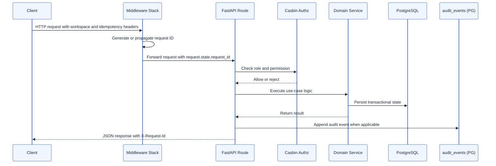
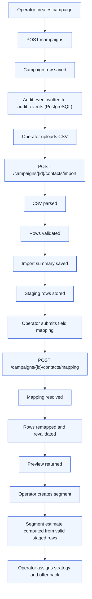
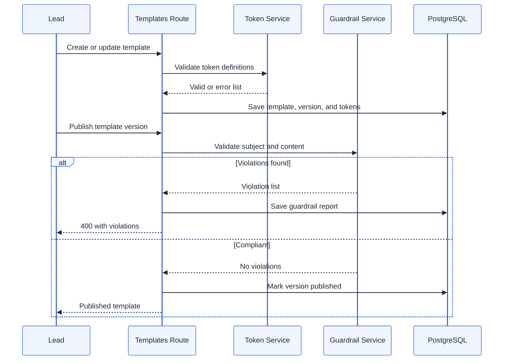
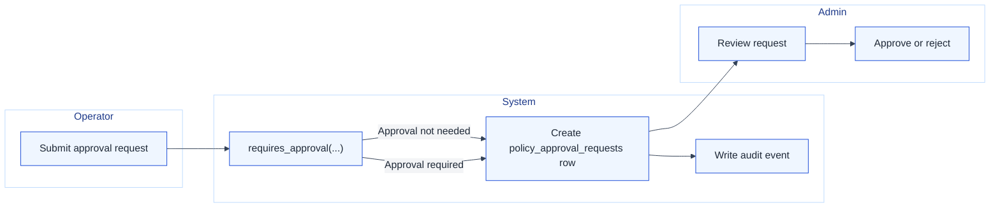
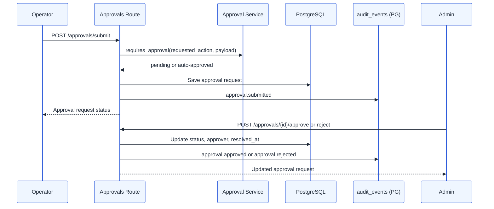
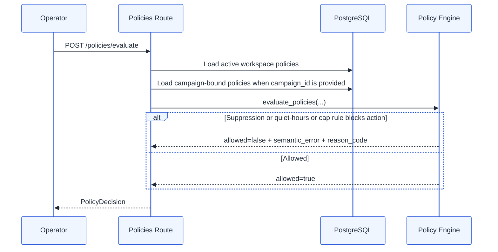
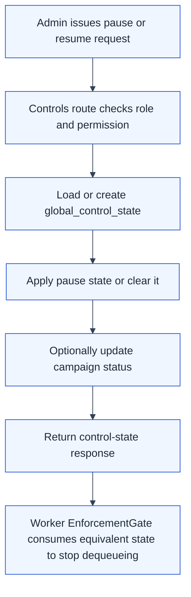
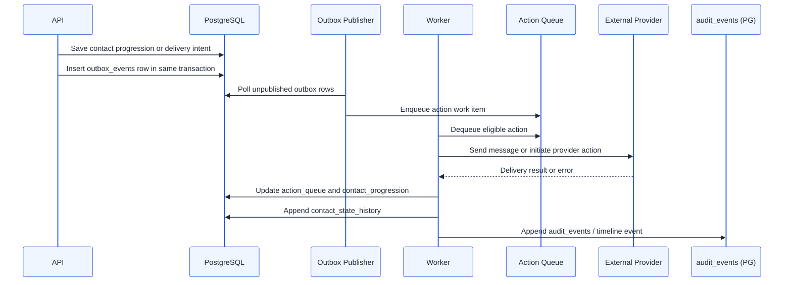
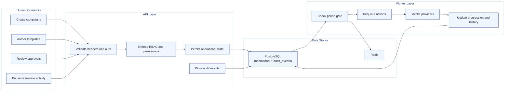

# SignalLoop Process Flows

This document captures the main runtime flows that matter for operators and developers. The goal is to show where context is enforced, where state changes happen, and where asynchronous processing is expected to take over.

## 1. API Request Envelope

Every important mutation follows the same high-level envelope:

## 2. Campaign Intake Flow

This is the most complete business flow in the repo today.

## 3. Template Authoring And Publish Guardrail Flow

## 4. Approval And Governance Flow

This flow captures how approval thresholds and governance controls are expected to work together.

And the approval decision itself:

## 5. Policy Evaluation Flow

## 6. Pause And Resume Control Flow

## 7. Target Delivery Pipeline Flow

This flow is partially implemented in schema and scaffolding. It describes the intended runtime path signaled by the Epic 2 tables.

## 8. Swimlane View Of Current And Emerging Responsibilities

## Practical Takeaway

If you want one short summary of the product flow, it is this:

1. Humans configure and govern outreach through the API.
2. The API captures durable intent and audit evidence.
3. The worker layer is being built to turn that intent into reliable outbound actions.
4. Policy, approval, and pause controls exist to make sure automation stays governable.
