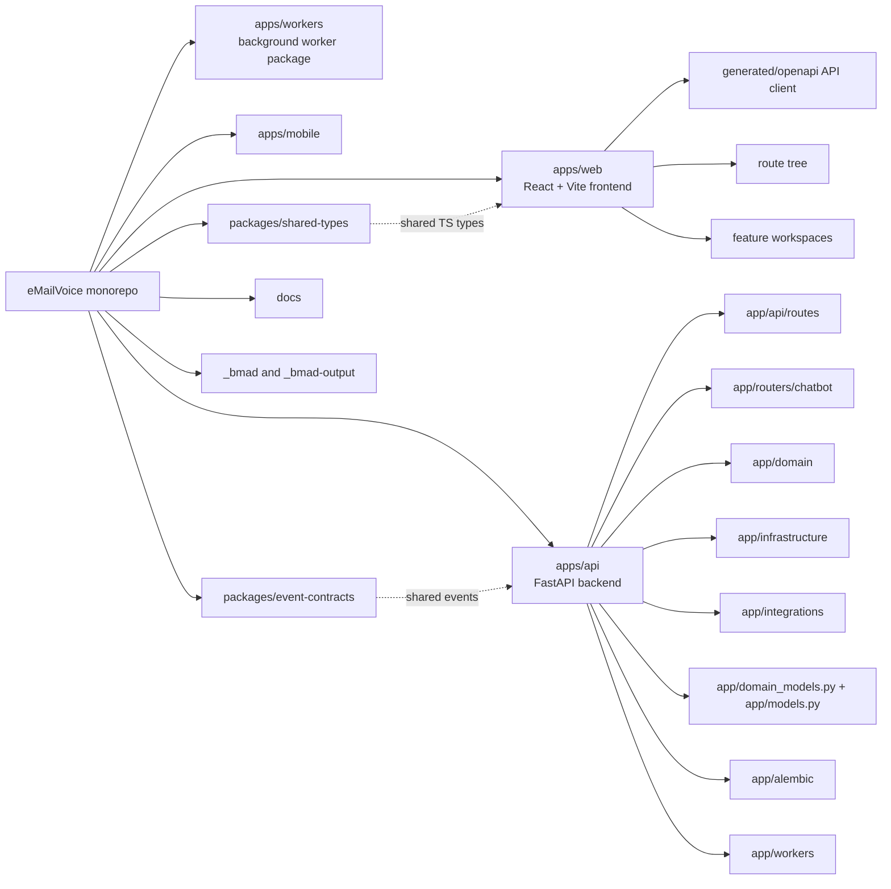
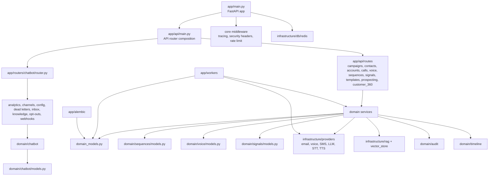
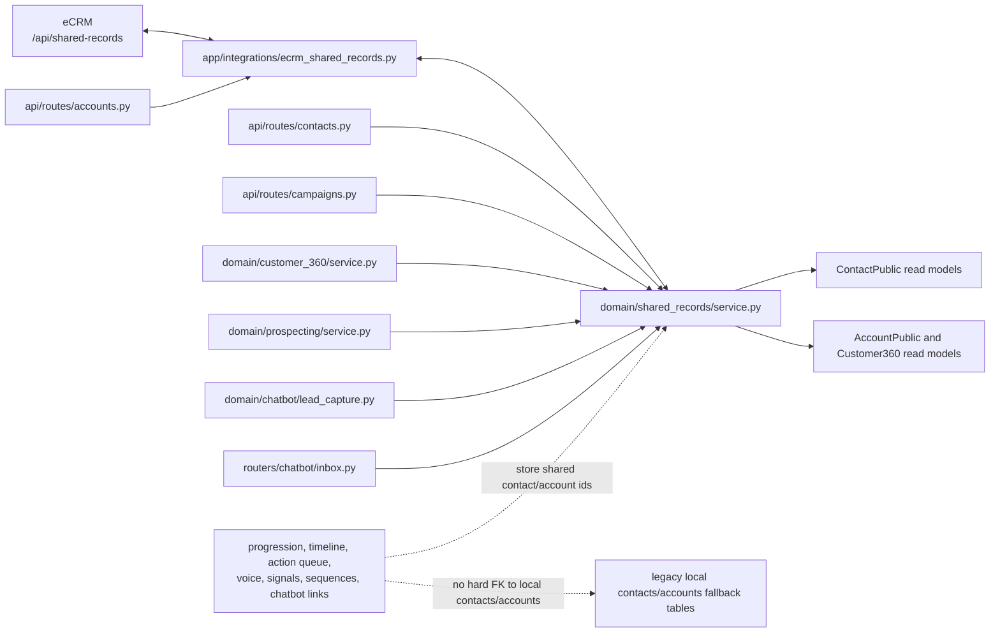
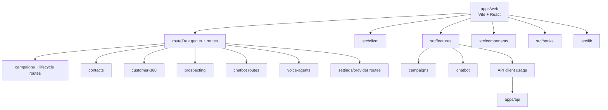
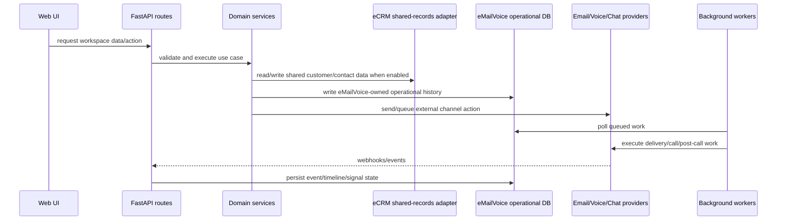

# eMailVoice Repository Graph

Generated from the current checkout on 2026-06-30.

## Workspace Graph

## Backend Layer Graph

## Shared CRM Cutover Graph

## Frontend Graph

## Operational Flow Graph

## Notes

- `apps/api/app/domain/shared_records/service.py` is now the shared CRM read adapter for eMailVoice page and service reads.
- `apps/api/app/integrations/ecrm_shared_records.py` is the HTTP boundary for eCRM `/api/shared-records`.
- Local `contacts` and `accounts` tables still exist as compatibility/fallback tables, but the current cutover path no longer requires operational rows to have hard foreign keys to those tables.
- ChatBot WhatsApp lead capture now upserts shared contacts directly, and the inbox lead detail view resolves the same shared record instead of reading the local `contacts` table.
- The graph is intentionally architectural. It does not include every file-level import edge because the repo currently has hundreds of source files and generated routes.
