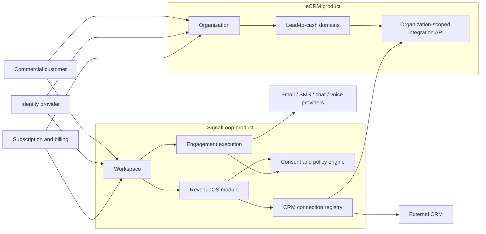
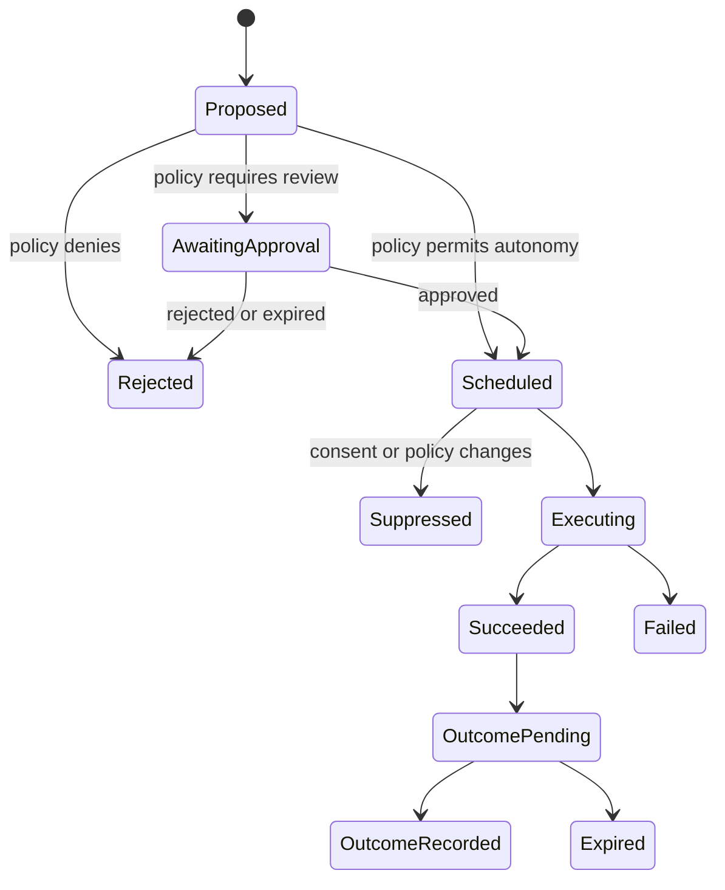

# RevenueOS Enterprise Product Architecture

**Status:** Approved target architecture  
**Date:** 2026-08-09  
**Decision owners:** Product and enterprise architecture  
**Applies to:** SignalLoop, the RevenueOS offering, eCRM integrations, and third-party CRM integrations

## 1. Executive decision

RevenueOS will be built as an independently licensed product capability inside the SignalLoop monorepo. eCRM remains an independently deployable CRM and system of record. A customer may purchase either product without the other, or connect them when both are licensed.

No third source repository or deployable control plane will be created at this stage. SignalLoop already owns the capabilities a new control plane would otherwise duplicate: workspaces, memberships, campaigns, sequences, providers, voice execution, policies, scheduling, audit events, and asynchronous workers.

This is a modular-monolith decision, not a permanent prohibition on service extraction. RevenueOS code must have explicit module boundaries and event/API contracts so it can be extracted when measurable operational conditions justify the cost.

## 2. Business architecture

### 2.1 Independently purchasable products

| Commercial offering | Primary job | Required products | Optional integrations |
|---|---|---|---|
| eCRM | Lead-to-cash system of record | eCRM only | SignalLoop, RevenueOS, external engagement platforms |
| SignalLoop | Multichannel engagement execution | SignalLoop only | eCRM, Salesforce, HubSpot, other CRMs |
| RevenueOS | Detect revenue risk, recommend or execute interventions, and prove outcomes | SignalLoop RevenueOS entitlement | eCRM or another CRM for richer system-of-record data |

Licensing is separate from repository layout. Packaging must never make eCRM a technical prerequisite for SignalLoop or RevenueOS.

### 2.2 Customer, tenant, and business-record terminology

- **Commercial customer:** A company purchasing one or more offerings, such as ARA Global, AI Consulting Inc, or HaloEHS.
- **Product tenant:** The isolation boundary inside one product. It is an `Organization` in eCRM and a `Workspace` in SignalLoop.
- **Account/customer record:** A company that the commercial customer is selling to. This record lives inside a tenant and must never be confused with the product tenant.
- **Installation connection:** A configured, authenticated link from one SignalLoop workspace to one CRM organization or instance.
- **Entitlement:** A product or capability licensed to a product tenant.

## 3. Current-state findings

### 3.1 SignalLoop

SignalLoop has a substantial multitenant foundation:

- workspace membership and role checks;
- `X-Workspace-Id` request validation;
- workspace-scoped campaign, account, contact, governance, provider, audit, and reporting records;
- per-workspace provider credentials and provider selection;
- outbound email, chat, SMS, and voice execution;
- scheduling, quiet-hour, cap, and suppression policies;
- CRM shared-record import and reconciliation.

The following gaps block an enterprise claim:

1. `apps/workers/worker_app/call_worker.py` polls one `DEFAULT_WORKSPACE_ID` instead of deriving the tenant from each job.
2. `ECRM_SHARED_API_BASE_URL` and `ECRM_SHARED_API_TOKEN` configure one global eCRM connection.
3. `consent_sync_service.py` treats missing consent as allowed.
4. `EmailSuppression` has no `workspace_id`, so suppression state and uniqueness are not tenant-safe.
5. Workspace filtering is implemented in application code without a complete database-level isolation backstop.
6. Product entitlements, customer lifecycle state, data residency, retention, metering, and per-tenant kill switches are incomplete.

### 3.2 eCRM

eCRM is explicitly single-company today:

- business records do not contain an organization identifier;
- user email is globally unique and sessions have no organization context;
- `BusinessSettings` is a singleton with INR as its default currency;
- branch country defaults to India;
- shared-data APIs use one static bearer token;
- ARA Global branding is embedded in the login experience.

The eCRM tenant conversion is defined separately in `C:\My Workspace\eCRM\docs\architecture\2026-08-09-ecrm-multitenancy-and-productization.md`.

## 4. Target logical architecture



### 4.1 Repository responsibilities

| Repository | Owns | Must not own |
|---|---|---|
| eCRM | CRM organizations, memberships, business records, lead-to-cash workflows, CRM configuration, CRM integration API | campaign execution, provider orchestration, autonomous engagement policy |
| SignalLoop | workspaces, channel execution, consent evidence, policies, RevenueOS signals/interventions/outcomes, connector registry | authoritative CRM financial/order state, eCRM-specific UI or schema |

### 4.2 Proposed SignalLoop modules

The following packages are architectural targets; implementation follows the repository's established FastAPI and SQLModel patterns.

```text
apps/api/app/domain/
  tenants/                 # workspace commercial profile, lifecycle, entitlements
  connections/             # CRM installation connections and secret references
  compliance/              # consent evidence, purposes, suppression, policy decisions
  revenue_intelligence/    # signals, scores, explanations, intervention proposals
  interventions/           # approval policy, dispatch, state machine, outcome linkage
  knowledge_governance/    # approved offer facts and version references
  metering/                 # tenant/channel/model usage and budget enforcement
```

The RevenueOS UI should live under a distinct route group and entitlement boundary rather than a separate frontend deployment.

## 5. Tenant and deployment architecture

### 5.1 Tenant roots

- eCRM issues an immutable `organization_id`.
- SignalLoop issues an immutable `workspace_id`.
- Neither ID is inferred from a brand name, subdomain, email domain, or CRM record.
- Human-readable slugs may change; immutable IDs may not.
- Cross-product connections store both IDs explicitly.

### 5.2 Deployment topologies

The logical tenant model must support both:

1. **Pooled SaaS:** Multiple tenants share application and database infrastructure. Every row and query is tenant-scoped, with PostgreSQL row-level security where practical.
2. **Dedicated enterprise cell:** One tenant receives a dedicated database or full deployment for residency, contractual isolation, or scale. The same organization/workspace model remains present, usually with one active tenant.

Dedicated cells are a deployment option, not a fork of the product.

### 5.3 Identity and authorization

Initial roles remain product-local. Future SSO may use a shared identity provider, but authorization is evaluated by each product against its own membership and entitlements.

Required claims and context:

```json
{
  "sub": "user-id",
  "active_tenant_id": "immutable-tenant-id",
  "membership_id": "membership-id",
  "roles": ["admin"],
  "session_version": 3
}
```

Changing tenant must create or refresh a server-validated session. A client-provided tenant header alone is never authority.

## 6. CRM connection contract

### 6.1 Connection record

Each SignalLoop workspace may own zero or more CRM connections, with at most one active primary CRM connection per purpose.

```json
{
  "id": "connection-id",
  "workspace_id": "ai-consulting-inc",
  "connector_type": "ecrm",
  "external_tenant_id": "ecrm-organization-id",
  "base_url": "https://crm.ai-consulting.example",
  "credential_ref": "vault://connections/connection-id",
  "data_region": "us",
  "status": "verified",
  "capabilities": ["accounts.read", "contacts.read", "activities.write"],
  "last_verified_at": "2026-08-09T12:00:00Z"
}
```

Plaintext secrets must not be returned by an API, logged, placed in events, or stored inside tenant configuration JSON.

### 6.2 Contract rules

- Every request carries authenticated source-product, source-tenant, target-tenant, correlation, and idempotency identifiers.
- eCRM validates that the credential is authorized for the target organization.
- Import and reconciliation jobs are connection-scoped, not globally configured.
- Webhooks are signed, replay-protected, idempotent, and retained for audit.
- Connector failure never causes cross-tenant fallback.
- A customer without eCRM can connect another CRM or operate SignalLoop's local operational records.

## 7. RevenueOS domain

### 7.1 Core aggregates

| Aggregate | Purpose |
|---|---|
| RevenueSignal | Immutable observation that may require attention, with source, evidence, severity, and freshness |
| InterventionPolicy | Tenant-approved conditions, channels, risk limits, budgets, and autonomy level |
| Intervention | Proposed or active action linked to one or more signals |
| InterventionAttempt | One channel execution attempt and its policy decision |
| Outcome | Measured result attributable to an intervention, including negative and no-response outcomes |
| KnowledgeRelease | Immutable approved facts used by an agent during an attempt |

### 7.2 Intervention state machine



No intervention may bypass policy evaluation. The policy decision and knowledge release are immutable evidence attached to every attempt.

## 8. Knowledge-governed agents

Agents may explain only approved facts for the tenant and effective date:

- product capabilities and exclusions;
- prices, discounts, taxes, currencies, and payment cycles;
- contract terms and approved variations;
- service areas, delivery promises, and support policies;
- qualification questions and approved objection responses.

When required knowledge is missing, contradictory, expired, or outside scope, the agent must refuse to invent an answer. It may capture the question, schedule a follow-up, or route an exception. This is limited human intervention for exceptions, not routine approval of every interaction.

## 9. Enterprise control plane capabilities

These capabilities live in the SignalLoop repository even though they form a logical control plane:

- tenant lifecycle and suspension;
- entitlements and feature gates;
- per-tenant provider and CRM connections;
- secret references and rotation status;
- consent purposes and jurisdiction policy packs;
- budgets, quotas, concurrency, and circuit breakers;
- global and per-tenant emergency stop;
- data retention, export, deletion, and legal hold;
- audit search and evidence export;
- regional routing and deployment metadata;
- model and knowledge-release governance;
- metering and invoice-grade usage records.

Administrative actions must be auditable and require elevated, tenant-scoped authorization. Platform support access must be time-bound, justified, and visible to the tenant.

## 10. Non-functional requirements

| Quality | Initial enterprise target |
|---|---|
| Tenant isolation | Automated negative tests at API, repository, worker, export, and webhook layers; database RLS for high-risk pooled tables |
| Availability | 99.9% monthly for control APIs; degraded channel providers must not corrupt state |
| Recovery | Documented RPO <= 15 minutes and RTO <= 4 hours before production enterprise launch |
| Audit | Immutable actor, tenant, action, resource, timestamp, correlation, decision, and result evidence |
| Security | encrypted transport and storage, managed secrets, rotation, least privilege, dependency and container scanning |
| Privacy | purpose limitation, minimization, configurable retention, export/deletion workflow, regional policy packs |
| Observability | tenant-safe metrics, traces and logs; no message bodies or secrets by default |
| Cost control | per-tenant channel/model budgets, alerts, throttles, and hard stops |
| Explainability | signals and interventions retain source evidence and decision reasons |

## 11. Extraction criteria for a future third service

RevenueOS should be extracted only when at least two of the following are observed and documented:

1. It requires a materially different release cadence or reliability objective from SignalLoop execution.
2. Its compute/storage profile independently causes scaling or availability incidents.
3. A separate team owns it with a stable API and on-call boundary.
4. Regulatory or contractual isolation cannot be met within the shared deployment.
5. More than one execution platform needs the same RevenueOS control plane.
6. Module coupling prevents independent testing or deployment despite enforced boundaries.

Extraction requires an ADR containing measured evidence, data ownership, migration strategy, failure semantics, and operating cost. Repository aesthetics alone are not sufficient.

## 12. Architecture decisions

| ID | Decision | Consequence |
|---|---|---|
| ADR-ROS-001 | Keep two repositories | Avoid duplicated platform foundations and integration overhead |
| ADR-ROS-002 | RevenueOS is an independently licensed SignalLoop module | Product packaging stays independent of code layout |
| ADR-ROS-003 | eCRM and SignalLoop retain separate tenant roots | Either product can be purchased and operated alone |
| ADR-ROS-004 | Use explicit installation connections | Cross-product access is authorized, tenant-safe, replaceable, and auditable |
| ADR-ROS-005 | Model tenant identity in every topology | Pooled and dedicated deployments use the same application semantics |
| ADR-ROS-006 | Unknown consent denies autonomous outreach | Missing data cannot silently authorize a regulated action |
| ADR-ROS-007 | Knowledge releases are immutable execution evidence | Agents cannot improvise commercial commitments |

## 13. Principal risks and mitigations

| Risk | Mitigation |
|---|---|
| Tenant filter omitted in one code path | tenant-aware repository APIs, RLS, static checks, and adversarial cross-tenant tests |
| Product packaging leaks into architecture | entitlements at module boundaries; no eCRM dependency in SignalLoop core |
| Consent evidence is incomplete | deny by default; immutable evidence and source provenance |
| Agent invents price or contract term | knowledge-release allowlist and deterministic response policy |
| Connector outage causes stale decisions | freshness thresholds, reconciliation, circuit breaker, visible degraded state |
| Third repo is created prematurely | extraction criteria and ADR approval gate |
| Dedicated tenant deployments drift | one build artifact, infrastructure parameters only, automated conformance tests |

## 14. Definition of architecture completion

The enterprise architecture is implemented only when:

- all product data paths have an authenticated tenant context;
- every background job derives its tenant from the job or record;
- cross-tenant negative tests pass for reads, writes, exports, webhooks, and workers;
- eCRM connections are workspace-scoped and secret-managed;
- unknown consent blocks regulated outreach;
- ARA Global, AI Consulting Inc, and HaloEHS can be provisioned from configuration without code changes;
- each product operates successfully without the other;
- the RevenueOS entitlement enables its APIs, jobs, UI, and metering independently;
- audit evidence can reconstruct why an intervention occurred and what knowledge it used.

