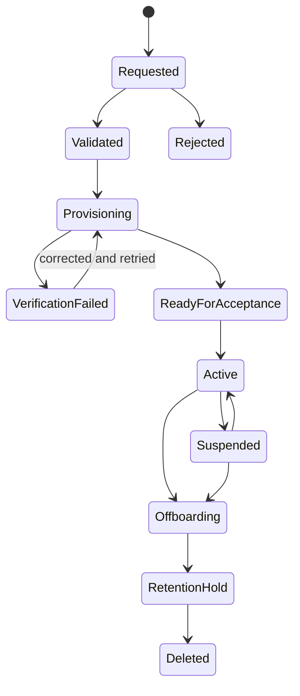

# Tenant Onboarding and Product Packaging Specification

**Status:** Approved design  
**Date:** 2026-08-09  
**Applies to:** ARA Global, AI Consulting Inc, HaloEHS, and future customers

## 1. Purpose

This specification defines how a commercial customer is provisioned into eCRM, SignalLoop, or RevenueOS without hard-coded company assumptions. It separates product licensing from technical integration and makes onboarding repeatable, auditable, reversible, and testable.

## 2. Packaging principles

1. eCRM, SignalLoop, and RevenueOS have independent SKUs and entitlements.
2. Buying eCRM does not provision SignalLoop unless requested.
3. Buying SignalLoop does not require eCRM; another CRM connector or local operational records may be used.
4. RevenueOS is an entitlement within SignalLoop, but it may be marketed and contracted independently.
5. Cross-product discounts are commercial configuration, never a runtime dependency.
6. Customer branding and policy never require a source-code branch.

## 3. Required tenant configuration

The provisioning API accepts a versioned request shaped like the following. Secrets are supplied through a secret manager workflow and referenced by ID; they are not embedded in this document.

```yaml
schemaVersion: 1
customer:
  legalName: AI Consulting Inc
  displayName: AI Consulting
  customerKey: ai-consulting-inc
  billingCountry: US
products:
  ecrm:
    enabled: true
    edition: professional
  signalloop:
    enabled: true
    edition: professional
  revenueos:
    enabled: true
    edition: enterprise
localization:
  timezone: America/New_York
  locale: en-US
  currency: USD
  defaultCountry: US
branding:
  productName: AI Consulting CRM
  logoAssetId: asset-ai-consulting-logo
  primaryColor: "#153B5B"
dataPolicy:
  region: us
  retentionProfile: standard-us-b2b
  compliancePacks:
    - us-federal-commercial-email
    - us-ai-voice-consented
limits:
  monthlyEmail: 20000
  monthlyVoiceMinutes: 500
  concurrentVoiceCalls: 2
connections:
  primaryCrm:
    type: ecrm
    externalTenantKey: ai-consulting-inc
```

## 4. Tenant lifecycle



Transitions are commands with idempotency keys. Every transition records actor, reason, prior state, target state, correlation ID, and result.

## 5. Provisioning workflow

### 5.1 Preflight

- validate the legal and display names;
- reserve immutable IDs and unique slugs;
- verify purchased SKUs and commercial effective dates;
- validate region, locale, currency, and timezone;
- require at least one tenant administrator;
- validate that referenced compliance packs support requested channels;
- reject embedded secrets, unsupported country/channel combinations, or duplicate active connections.

### 5.2 Product provisioning

Provision each licensed product independently:

1. Create the product tenant in `PROVISIONING` state.
2. Create the first membership using an invitation, never a shared default password.
3. Apply localization, branding, retention, and limits.
4. Apply product entitlements.
5. Register secret references and provider selections.
6. Create jurisdiction policy packs with outreach disabled until verified.
7. Run tenant-isolation and configuration probes.
8. Mark the product tenant `READY_FOR_ACCEPTANCE`.

Failure in one product does not delete or corrupt another already-provisioned product. The orchestration record reports partial completion and safe retry instructions.

### 5.3 Connection provisioning

When both products or an external CRM are present:

1. Create a pending connection record in SignalLoop.
2. Create a least-privilege organization-scoped service credential in the CRM.
3. Store the credential in the secret manager and retain only its reference.
4. Verify TLS, tenant identity, required capabilities, and clock tolerance.
5. Perform a dry-run export/import with a synthetic canary record.
6. Delete the canary and verify deletion reconciliation.
7. Activate the connection only when every check passes.

## 6. Customer configuration matrix

| Dimension | ARA Global | AI Consulting Inc | HaloEHS |
|---|---|---|---|
| Primary market | India | United States | India |
| Locale | `en-IN` | `en-US` | `en-IN` initially |
| Timezone | `Asia/Kolkata` | customer-selected US zone; initial `America/New_York` | `Asia/Kolkata` |
| Currency | INR | USD | INR |
| eCRM branding | ARA Global | AI Consulting | HaloEHS |
| Lead geography | India and configured markets | United States | India and configured markets |
| Initial voice posture | consent/preference gated | consented/inbound AI voice only | registered-sender and consent/preference gated |
| Knowledge corpus | ARA capabilities and commercial rules | AI consulting services and US commercial rules | HaloEHS capabilities and commercial rules |
| Provider credentials | tenant-owned references | tenant-owned references | tenant-owned references |

The matrix contains defaults, not code constants. A tenant administrator may change permitted fields through validated configuration.

## 7. ARA Global conversion runbook

ARA Global becomes the first explicit tenant rather than the implicit global company.

1. Create immutable eCRM organization and SignalLoop workspace IDs.
2. Inventory all existing records and verify they belong to ARA Global.
3. Backfill the eCRM `organizationId` on every record in one transaction or controlled migration batch.
4. Backfill/verify SignalLoop workspace IDs and quarantine records using an unresolved default workspace.
5. Convert embedded ARA branding into `OrganizationBranding` configuration.
6. Convert INR, India, timezone, tax, product, payment, and contract defaults into versioned organization configuration.
7. Create the eCRM-to-SignalLoop installation connection.
8. Reconcile counts and referential integrity before enabling writes.
9. Run cross-tenant negative tests using a synthetic second tenant.
10. Preserve an export and rollback checkpoint until acceptance is signed off.

## 8. AI Consulting Inc onboarding runbook

1. Provision an eCRM organization and/or SignalLoop workspace according to purchased products.
2. Configure `en-US`, USD, United States address formats, and the selected operating timezones.
3. Load approved service catalog, capability boundaries, price book, taxes, payment cycles, and contract terms as a versioned knowledge release.
4. Configure email sending identity, domain authentication, physical postal address, and unsubscribe processing.
5. Enable inbound AI voice and explicit callback-request flows.
6. Configure consent language naming AI Consulting Inc and the intended use of artificial/AI voice.
7. Keep autonomous outbound AI voice disabled until counsel approves the form, evidence, scripts, states, and suppression behavior.
8. Configure lead sources with provenance and permitted-channel metadata.
9. Run seed-to-appointment acceptance using synthetic leads only.
10. Activate limited production budgets and inspect the first campaign through an enhanced monitoring window.

## 9. HaloEHS onboarding runbook

1. Provision selected products with India region, `Asia/Kolkata`, INR, and HaloEHS branding.
2. Load the HaloEHS knowledge release and approved languages.
3. Register commercial communication identities and provider configuration required by the telecom operator and TRAI framework.
4. Configure consent, registered preferences, DND suppression, purpose, and expiry rules.
5. Prohibit commercial outreach from ordinary unregistered ten-digit subscriber numbers.
6. Configure India data-protection notice, retention, correction, and deletion workflows.
7. Test voice disclosure, opt-out, quiet hours, suppression propagation, and evidence export.
8. Activate each channel independently after its compliance gate passes.

## 10. Branding and commercial knowledge

### 10.1 Branding

Branding configuration includes product display name, logos, colors, support contacts, legal links, email sender identity, and document templates. Asset uploads are scanned, versioned, and referenced by immutable asset ID.

Missing branding falls back to neutral product branding, never ARA Global.

### 10.2 Commercial knowledge releases

A knowledge release contains effective-dated, approved facts:

```json
{
  "release_id": "kr_2026_08_09_001",
  "tenant_id": "ai-consulting-inc",
  "effective_from": "2026-08-09T00:00:00Z",
  "approved_by": "commercial-approver-id",
  "capabilities": [],
  "price_books": [],
  "tax_rules": [],
  "payment_cycles": [],
  "contract_terms": [],
  "prohibited_claims": []
}
```

Published releases are immutable. Corrections create a new release. Every automated interaction records the release it used.

## 11. Entitlement enforcement

Entitlements are enforced in four places:

- API authorization;
- UI route and navigation availability;
- job creation and worker execution;
- usage metering and billing export.

A hidden menu item is not entitlement enforcement. Workers must re-check tenant status, entitlement, consent, and budget immediately before dispatch.

## 12. Onboarding acceptance evidence

Activation requires an evidence bundle containing:

- approved provisioning request and its schema version;
- tenant and membership IDs;
- entitlement snapshot;
- branding and localization preview approval;
- provider verification results without secrets;
- compliance pack versions and channel approvals;
- connector canary and reconciliation report;
- cross-tenant isolation probe results;
- backup/restore or rollback checkpoint;
- named customer and platform approvers.

## 13. Offboarding and suspension

- Suspension immediately blocks new logins, job creation, and channel dispatch while preserving audit evidence.
- Offboarding revokes provider and CRM credentials first.
- Data is exported only to an authenticated, authorized destination.
- Retention and deletion execute according to contract and legal hold.
- Deletion is verified across primary stores, queues, search indexes, object storage, caches, and provider-held data where contractually supported.
- Reusing a deleted tenant slug must never expose or reconnect old data.

## 14. Service objectives

| Operation | Target |
|---|---|
| Standard tenant preflight | 5 minutes |
| Automated product provisioning | 30 minutes excluding external DNS/provider work |
| Suspension propagation | 5 minutes maximum |
| Credential revocation propagation | 5 minutes maximum |
| Tenant configuration rollback | one prior published version |
| Failed step retry | idempotent, no duplicate tenant or membership |

## 15. Acceptance criteria

- Each of the three named customers can be provisioned from data without source changes.
- The same build artifact supports pooled and dedicated deployments.
- A tenant can purchase and operate only eCRM or only SignalLoop.
- RevenueOS APIs, UI, workers, and metering are unavailable without its entitlement.
- Connector credentials cannot access an organization other than the mapped target.
- A failed or suspended tenant cannot dispatch queued work.
- Branding, pricing, taxes, payment cycles, and contract terms are versioned tenant data.
- Onboarding emits an auditable evidence bundle and supports safe retry.

