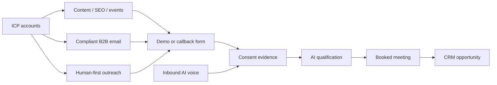

# Voice Consent and Lead Generation Architecture

**Status:** Approved product and architecture policy  
**Date:** 2026-08-09  
**Scope:** AI Consulting Inc United States acquisition, ARA Global and HaloEHS India outreach, and reusable SignalLoop controls

> This document is a product and technical control plan, not legal advice. Qualified counsel must approve production campaign categories, consent language, state-specific recording rules, and provider practices before activation.

## 1. Decision

Voice agents are a valid product capability, but cold autonomous AI sales calling is not the lead-generation foundation for AI Consulting Inc.

The acquisition system will generate demand through compliant B2B email, content, events, partners, referrals, human-first outreach, and inbound experiences. AI voice will handle inbound calls, requested callbacks, and outbound qualification or appointment-setting only when the platform has sufficient, provable consent for that seller, purpose, number, jurisdiction, and technology.

Unknown consent is denied. A phone number in a CRM is not consent.

## 2. Regulatory baseline used for this design

### 2.1 United States federal baseline

The FCC's February 2024 declaratory ruling states that AI-generated or simulated voices fall under the TCPA's artificial or prerecorded voice restrictions. Prior express consent is required absent an exception; advertising or telemarketing calls require prior express written consent. Artificial/prerecorded messages also have identification and opt-out requirements.

Primary source: [FCC 24-17](https://docs.fcc.gov/public/attachments/FCC-24-17A1.pdf)

The FTC's Telemarketing Sales Rule guidance requires direct, specific-seller permission for covered prerecorded telemarketing and describes automated opt-out and recordkeeping obligations. Most B2B solicitation calls have a TSR exemption, but that exemption does not remove TCPA, FCC, state-law, deception, recording, or provider obligations.

Primary sources:

- [FTC Telemarketing Sales Rule compliance guide](https://www.ftc.gov/business-guidance/resources/complying-telemarketing-sales-rule)
- [FTC 2024 telemarketing recordkeeping guidance](https://www.ftc.gov/business-guidance/blog/2024/10/mark-your-calendars-telemarketers-sellers-october-15-telemarketing-sales-rules-record-store-day)

Commercial email, including B2B email, is subject to CAN-SPAM requirements such as accurate headers, non-deceptive subjects, advertising identification, a physical address, working opt-out, timely suppression, and vendor oversight.

Primary source: [FTC CAN-SPAM compliance guide](https://www.ftc.gov/business-guidance/resources/can-spam-act-compliance-guide-business)

### 2.2 India baseline

TRAI defines unsolicited commercial communication by reference to recipient consent and registered preferences. It defines robocalls as calls using artificial or prerecorded voice without a human on the calling side, requires registered identities for commercial communication, and warns against unsolicited commercial communication from ordinary ten-digit subscriber numbers.

Primary sources:

- [TRAI explanation of spam and UCC](https://trai.gov.in/what-spam-or-ucc)
- [TRAI UCC regulations and consumer initiatives](https://trai.gov.in/telecom/consumer-initiatives/unsolicited-commercial-communication)
- [MeitY Digital Personal Data Protection Rules 2025](https://www.meity.gov.in/documents/act-and-policies/digital-personal-data-protection-rules-2025-gDOxUjMtQWa)

## 3. Channel policy matrix

`LEGAL_REVIEW` means the platform contains the controls but the tenant cannot activate that use case until documented counsel approval.

| Use case | United States default | India default | Required evidence |
|---|---|---|---|
| Inbound AI receptionist | Allowed with disclosure and recording controls | Allowed with disclosure, provider and privacy controls | inbound call event, disclosure version, recording choice |
| Requested immediate callback | Allowed when request and AI-voice authorization are captured | Allowed subject to consent/preferences and registered sender controls | form/event, timestamp, number, seller, purpose, text version |
| Outbound AI sales qualification | `LEGAL_REVIEW`; written consent required by platform policy | `LEGAL_REVIEW`; consent/preferences and registered commercial communication | consent evidence plus policy-pack approval |
| Cold autonomous AI sales call | Prohibited | Prohibited by default | no activation path |
| Human B2B prospecting call | `LEGAL_REVIEW`; state, DNC and provider controls | `LEGAL_REVIEW`; TRAI/provider controls | campaign approval and suppression checks |
| Appointment reminder requested by recipient | Allowed as informational policy when content remains non-promotional | Allowed subject to service-message classification | appointment request and message classification |
| B2B commercial email | Allowed through CAN-SPAM policy | Allowed only through configured India email/privacy policy | source provenance, sender identity, unsubscribe support |
| Referral or partner introduction | Email/human-first; AI voice only after direct consent | Email/human-first; AI voice only after required consent | provenance and direct permission |

## 4. Consent evidence model

Consent is immutable evidence plus derived current state. Editing a CRM checkbox must not rewrite history.

```json
{
  "consent_id": "uuid",
  "tenant_id": "ai-consulting-inc",
  "subject_contact_id": "contact-id",
  "destination": "+12125550100",
  "channel": "voice",
  "technology": "ai_artificial_voice",
  "purpose": "sales_qualification",
  "seller_legal_name": "AI Consulting Inc",
  "status": "granted",
  "captured_at": "2026-08-09T14:30:00Z",
  "expires_at": "2026-11-07T14:30:00Z",
  "source_type": "web_callback_form",
  "source_uri": "https://example.com/request-call",
  "disclosure_version": "aic-us-ai-voice-v1",
  "disclosure_hash": "sha256:1111111111111111111111111111111111111111111111111111111111111111",
  "proof_asset_ref": "evidence://consent/uuid/source-payload",
  "ip_address_hash": "sha256:2222222222222222222222222222222222222222222222222222222222222222",
  "user_agent_hash": "sha256:3333333333333333333333333333333333333333333333333333333333333333",
  "correlation_id": "uuid"
}
```

Revocation, expiry, correction, and suppression are new events. The current state projection uses the latest valid event and the strictest applicable suppression.

## 5. Policy evaluation

Every dispatch evaluates the complete context immediately before provider invocation:

```text
decision = evaluate(
  tenant_status,
  entitlement,
  campaign_approval,
  destination_jurisdiction,
  channel_and_technology,
  purpose,
  consent_evidence,
  national_and_tenant_suppression,
  quiet_hours_at_destination,
  frequency_caps,
  provider_registration,
  knowledge_release,
  tenant_budget,
  emergency_stop
)
```

The result is `ALLOW`, `DENY`, or `REVIEW`. Only `ALLOW` can create an external side effect. `REVIEW` is not an implicit allowance.

Required deny reasons include:

- `CONSENT_MISSING`
- `CONSENT_EXPIRED`
- `CONSENT_PURPOSE_MISMATCH`
- `CONSENT_SELLER_MISMATCH`
- `DESTINATION_SUPPRESSED`
- `QUIET_HOURS`
- `FREQUENCY_CAP`
- `PROVIDER_NOT_REGISTERED`
- `KNOWLEDGE_RELEASE_INVALID`
- `TENANT_SUSPENDED`
- `ENTITLEMENT_MISSING`
- `BUDGET_EXHAUSTED`
- `CAMPAIGN_NOT_APPROVED`

## 6. AI Consulting Inc lead-generation engine

### 6.1 Targeting

Define an ideal customer profile using business attributes rather than protected personal characteristics. Examples include industry, employee range, operating region, technology signals, job roles, published initiatives, and service fit.

Every prospect record stores:

- source and acquisition date;
- business versus personal contact classification;
- geographic and timezone confidence;
- permitted channels and reasons;
- suppression checks;
- evidence freshness;
- data-use notice or source restrictions where applicable.

Purchased or scraped data is not automatically dialable.

### 6.2 Acquisition funnel



### 6.3 Initial channel plays

1. **Assessment offer:** Industry-specific AI readiness or automation assessment landing pages.
2. **Expert content:** Case studies, architecture guides, ROI calculators, and webinars with honest claims.
3. **Targeted B2B email:** Small, relevant account lists; accurate sender identity; one clear value proposition; easy unsubscribe.
4. **Partner/referral network:** Technology vendors, professional networks, and existing trusted relationships.
5. **Human-first outreach:** Human contact requests permission for an AI-assisted discovery callback where appropriate.
6. **Inbound voice:** An AI receptionist answers published business numbers, discloses its nature, qualifies, and schedules.
7. **Consent conversion:** High-intent visitors choose a specific callback purpose and time with clear named-seller AI-voice language.

The first success metric is qualified meetings that progress, not dial volume or superficial reply count.

## 7. Knowledge-governed conversation design

The agent receives a published tenant knowledge release containing exact capability, pricing, tax, payment-cycle, and contract data. Responses use three modes:

1. **Answer:** A single unambiguous approved fact supports the response.
2. **Clarify:** Approved choices exist but the prospect's context is incomplete.
3. **Do not assert:** Knowledge is absent, expired, contradictory, or requires authority. Capture the question and arrange an approved next step.

The agent must not:

- invent a capability, integration, reference customer, price, discount, tax, delivery date, or contract term;
- state that legal, security, privacy, or regulatory approval exists when it does not;
- accept nonstandard contract language or payment commitments;
- conceal that it is automated when disclosure is required by policy;
- continue after an opt-out or revocation signal.

## 8. Voice interaction controls

At call start, the agent follows the active policy pack and script version to:

- identify the responsible seller;
- disclose automation/AI use when required by policy;
- state the purpose before a sales pitch;
- request recording consent before recording where required;
- provide or recognize opt-out language;
- stop immediately when the recipient withdraws consent or asks not to be called;
- avoid collecting payment credentials or highly sensitive information in the initial release.

An opt-out phrase must synchronously suppress the destination before the call ends. Downstream CRM and campaign projections are updated through idempotent events.

## 9. Minimal-human operating model

Automation owns routine work:

- source enrichment and deduplication;
- policy and suppression checks;
- email sequencing;
- inbound qualification;
- consented callbacks;
- calendar availability and scheduling;
- CRM activity and outcome updates;
- knowledge-based product and commercial answers;
- monitoring, retry, and evidence packaging.

Human intervention is reserved for policy exceptions, knowledge contradictions, high-risk commitments, security incidents, complaints, and legal review. The system must not label a missing control as a request for routine human approval; it must close the control gap.

## 10. Campaign approval and monitoring

Every campaign has:

- tenant and seller identity;
- purpose, audience, source, geography, channels, and technology;
- consent and suppression requirements;
- script and knowledge-release versions;
- quiet hours, caps, budget, and stop thresholds;
- complaint, opt-out, wrong-party, and error thresholds;
- legal-review evidence when required;
- named owner and expiry date.

Automatic stop conditions include consent lookup failure, suppression sync lag, complaint-rate breach, provider identity failure, unexpected geography, cost anomaly, or knowledge-release withdrawal.

## 11. Evidence and retention

Retain the minimum evidence needed to reconstruct compliance and business outcome:

- campaign and policy versions;
- consent and revocation events;
- suppression decision;
- called/calling identity, timestamps, duration, and disposition;
- script and knowledge release;
- provider request and response identifiers;
- recording choice and recording reference when lawful;
- opt-out result;
- meeting and CRM outcome.

Retention is jurisdiction- and contract-configured. Raw recordings and transcripts require stricter access, encryption, redaction, and deletion controls than operational metadata.

## 12. Acceptance criteria

- Missing or ambiguous consent blocks outbound AI voice.
- Consent is matched to tenant, seller, purpose, destination, channel, technology, and validity period.
- Revocation synchronously suppresses future dispatch and propagates to all relevant queues.
- Cold autonomous AI sales calling has no production activation path.
- AI Consulting Inc can generate leads without voice through a compliant email/content/partner funnel.
- Inbound and requested-callback AI calls produce complete evidence.
- Knowledge-grounded tests prove the agent does not invent capabilities or commercial terms.
- India campaigns require registered sender/provider configuration and preference checks.
- Every attempt is reconstructable from immutable policy, consent, knowledge, and provider evidence.
