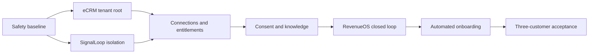

# RevenueOS Enterprise Offering Implementation Plan

> **For agentic workers:** REQUIRED SUB-SKILL: Use superpowers:subagent-driven-development (recommended) or superpowers:executing-plans to implement this plan task-by-task. Steps use checkbox (`- [ ]`) syntax for tracking.

**Goal:** Productize eCRM, SignalLoop, and RevenueOS as independently licensable enterprise offerings with provable tenant isolation, repeatable onboarding, knowledge-governed automation, and consent-safe lead generation.

**Architecture:** Keep two repositories. Add native organization tenancy to eCRM; harden SignalLoop's existing workspace tenancy; implement RevenueOS as an entitlement-bound module inside SignalLoop; connect products through tenant-scoped installation connections. Use a modular monolith with explicit events and interfaces so RevenueOS can be extracted only when the approved architecture criteria are met.

**Tech Stack:** Next.js 16, React 19, TypeScript 6, Prisma 6, PostgreSQL, Vitest and Playwright in eCRM; FastAPI, SQLModel, Alembic, PostgreSQL, Redis workers, pytest, React/Vite and Playwright in SignalLoop.

---

## Governing specifications

- `docs/enterprise/2026-08-09-revenueos-enterprise-architecture.md`
- `docs/enterprise/2026-08-09-tenant-onboarding-and-product-packaging.md`
- `docs/enterprise/2026-08-09-voice-consent-and-lead-generation.md`
- `C:\My Workspace\eCRM\docs\architecture\2026-08-09-ecrm-multitenancy-and-productization.md`

## Delivery rules

1. Execute in an isolated worktree per repository; do not mix this work with current dirty working-tree changes.
2. Use expand/backfill/contract migrations. Never introduce a required tenant field before existing rows are reconciled.
3. Write the failing tenant-isolation or policy test before each production change.
4. Treat `REVIEW` and unknown inputs as denial for external side effects.
5. Commit only the files named by the current task.
6. Do not activate a real email, SMS, chat, or voice campaign as part of automated tests.
7. Use synthetic organizations and destinations until the production-readiness gate is approved.

## File and module map

### eCRM repository: `C:\My Workspace\eCRM`

| Responsibility | Files |
|---|---|
| Tenant schema and migration | `prisma/schema.prisma`, `prisma/migrations/20260809120000_add_organization_tenancy/migration.sql`, `prisma/seed.ts` |
| Session and organization context | `src/server/auth/session.ts`, `src/server/auth/login.ts`, `src/server/auth/current-user.ts`, `src/server/organizations/context.ts`, `src/server/organizations/actions.ts` |
| Tenant-scoped database execution | `src/server/db.ts`, `src/server/organizations/with-organization.ts`, domain query/mutation files under `src/server/**` |
| Branding and settings | `src/server/organizations/branding.ts`, `src/app/(auth)/login/login-landing.tsx`, `src/components/app-shell.tsx`, admin settings components |
| Integration credentials | `src/server/integrations/credentials.ts`, `src/server/shared-records/api-auth.ts`, shared-record and workflow-event routes |
| Isolation tests | `src/server/organizations/*.test.ts`, domain tests, `tests/e2e/tenant-isolation.spec.ts` |

### SignalLoop repository: `C:\Users\K.Ramachandran\eMailVoice`

| Responsibility | Files |
|---|---|
| Isolation blockers | `apps/api/app/domain/policies/consent_sync_service.py`, `apps/api/app/domain/sequences/suppression.py`, `apps/workers/worker_app/call_worker.py`, `apps/api/app/alembic/versions/tenant_20260809_close_workspace_isolation.py`, `apps/api/tests/domain/test_consent_sync_service.py`, `apps/api/tests/domain/test_email_suppression.py`, `apps/workers/tests/unit/test_call_worker.py` |
| Tenant lifecycle and entitlements | `apps/api/app/domain/tenants/models.py`, `service.py`, `apps/api/app/api/routes/tenants.py` |
| CRM installation connections | `apps/api/app/domain/connections/models.py`, `service.py`, `apps/api/app/integrations/ecrm_shared_records.py` |
| Consent and knowledge governance | `apps/api/app/domain/compliance/**`, `apps/api/app/domain/knowledge_governance/**` |
| RevenueOS | `apps/api/app/domain/revenue_intelligence/**`, `apps/api/app/domain/interventions/**`, route and worker modules |
| Onboarding | `apps/api/app/domain/onboarding/**`, `apps/api/app/api/routes/onboarding.py` |
| Web UI | routes/components under `apps/web/src` following the existing TanStack Router structure |
| Enterprise tests | focused API/unit/worker tests plus Playwright tenant and onboarding specifications |

## Milestone order



### Task 1: Establish migration and isolation baselines

**Files:**
- Create: `C:\My Workspace\eCRM\src\test\tenant-fixtures.ts`
- Create: `apps/api/tests/utils/tenant_security.py`
- Create: `docs/operations/enterprise-migration-baseline.md`
- Test: `C:\My Workspace\eCRM\src\test\tenant-fixtures.test.ts`
- Test: `apps/api/tests/unit/test_tenant_security_helpers.py`

- [ ] **Step 1: Record clean baseline commands without altering either working tree**

Run in eCRM:

```powershell
npm run typecheck
npm run lint
npm run test
npm run build
```

Run in SignalLoop:

```powershell
uv run --project apps/api pytest apps/api/tests/unit apps/api/tests/api -q
uv run --project apps/api ruff check apps/api/app apps/api/tests
uv run --project apps/api mypy apps/api/app
npm run build
```

Expected: Capture pass/fail, duration, commit SHA, database availability, and pre-existing failures in `docs/operations/enterprise-migration-baseline.md`. A pre-existing failure is recorded; it is not silently attributed to tenant work.

- [ ] **Step 2: Write failing fixture-helper tests**

Add an eCRM test proving two tenants can intentionally reuse the same business names while retaining distinct IDs:

```ts
import { describe, expect, it } from "vitest";
import { tenantFixture } from "./tenant-fixtures";

describe("tenantFixture", () => {
  it("creates stable, distinct tenant-owned identifiers", () => {
    const alpha = tenantFixture("alpha");
    const beta = tenantFixture("beta");
    expect(alpha.organizationId).not.toBe(beta.organizationId);
    expect(alpha.leadName).toBe(beta.leadName);
  });
});
```

Add a SignalLoop helper test:

```python
from tests.utils.tenant_security import tenant_pair


def test_tenant_pair_has_distinct_workspace_ids() -> None:
    alpha, beta = tenant_pair()
    assert alpha.workspace_id != beta.workspace_id
    assert alpha.contact_email == beta.contact_email
```

- [ ] **Step 3: Run the tests and verify missing-helper failures**

```powershell
npm test -- src/test/tenant-fixtures.test.ts
uv run --project apps/api pytest apps/api/tests/unit/test_tenant_security_helpers.py -q
```

Expected: FAIL because the fixture modules do not exist.

- [ ] **Step 4: Implement deterministic synthetic tenant helpers**

The helpers return immutable IDs derived from the fixture key and use non-routable/example contact data. They must never contain production phone numbers, credentials, or customer records.

- [ ] **Step 5: Re-run focused tests and commit**

```powershell
npm test -- src/test/tenant-fixtures.test.ts
uv run --project apps/api pytest apps/api/tests/unit/test_tenant_security_helpers.py -q
git add src/test/tenant-fixtures.ts src/test/tenant-fixtures.test.ts
git commit -m "test: add ecrm tenant isolation fixtures"
```

Commit the SignalLoop files separately with `test: add workspace isolation fixtures`.

### Task 2: Add the eCRM organization root and ARA backfill

**Files:**
- Modify: `C:\My Workspace\eCRM\prisma\schema.prisma`
- Create: `C:\My Workspace\eCRM\prisma\migrations\20260809120000_add_organization_tenancy\migration.sql`
- Modify: `C:\My Workspace\eCRM\prisma\seed.ts`
- Create: `C:\My Workspace\eCRM\prisma\organization-backfill.test.ts`

- [ ] **Step 1: Write a failing schema contract test**

```ts
import { readFileSync } from "node:fs";
import { describe, expect, it } from "vitest";

const schema = readFileSync(new URL("./schema.prisma", import.meta.url), "utf8");

describe("organization tenancy schema", () => {
  it("defines tenant roots and tenant-owned business records", () => {
    expect(schema).toContain("model Organization {");
    expect(schema).toContain("model OrganizationMembership {");
    expect(schema).toMatch(/model LeadCustomer[\s\S]*organizationId\s+String/);
    expect(schema).toMatch(/model SharedBusinessRecord[\s\S]*organizationId\s+String/);
    expect(schema).toContain("@@unique([organizationId, entityType, externalKey])");
  });
});
```

- [ ] **Step 2: Run the contract test and verify failure**

```powershell
npm test -- prisma/organization-backfill.test.ts
```

Expected: FAIL because `Organization` is absent.

- [ ] **Step 3: Add organization models and additive nullable ownership**

Add these root types and models, retaining legacy `User.role` during the expand phase:

```prisma
enum OrganizationStatus {
  PROVISIONING
  ACTIVE
  SUSPENDED
  OFFBOARDING
  DELETED
}

enum OrganizationRole {
  OWNER
  ADMIN
  SALES
  FINANCE
  PRODUCTION
  READ_ONLY
}

enum MembershipStatus {
  INVITED
  ACTIVE
  SUSPENDED
  REVOKED
}

model Organization {
  id               String             @id @default(cuid())
  key              String             @unique
  legalName        String
  displayName      String
  status           OrganizationStatus @default(PROVISIONING)
  deploymentRegion String
  createdAt        DateTime           @default(now())
  updatedAt        DateTime           @updatedAt
  memberships      OrganizationMembership[]
  settings         OrganizationSettings?
  branding         OrganizationBranding?
}

model OrganizationMembership {
  id             String           @id @default(cuid())
  organizationId String
  userId         String
  role           OrganizationRole
  status         MembershipStatus @default(INVITED)
  createdAt      DateTime         @default(now())
  updatedAt      DateTime         @updatedAt
  organization   Organization     @relation(fields: [organizationId], references: [id], onDelete: Cascade)
  user           User             @relation(fields: [userId], references: [id], onDelete: Cascade)

  @@unique([organizationId, userId])
  @@index([userId, status])
}
```

Add nullable `organizationId` to every table named in the eCRM architecture's ownership matrix. Add indexes but defer `NOT NULL`, RLS, and destructive constraint replacement.

- [ ] **Step 4: Generate and inspect the expand migration**

```powershell
npx prisma migrate dev --name add_organization_tenancy --create-only
npx prisma validate
npx prisma generate
```

Expected: migration contains additive tables, nullable columns, indexes, and foreign keys; it does not drop business data.

- [ ] **Step 5: Add the idempotent ARA Global backfill**

The migration creates `ara-global`, updates root records directly, derives child ownership from their parent, and aborts on unresolved rows. It records before/after counts in a migration reconciliation table or companion script output.

- [ ] **Step 6: Apply to a disposable database and verify**

```powershell
npx prisma migrate dev
npm test -- prisma/organization-backfill.test.ts
npm run typecheck
```

Expected: PASS; every existing business row belongs to ARA Global and the migration is repeat-safe.

- [ ] **Step 7: Commit the expand/backfill slice**

```powershell
git add prisma/schema.prisma prisma/migrations prisma/seed.ts prisma/organization-backfill.test.ts
git commit -m "feat: add ecrm organization tenancy foundation"
```

### Task 3: Put verified organization membership in eCRM sessions

**Files:**
- Modify: `C:\My Workspace\eCRM\src\server\auth\session.ts`
- Modify: `C:\My Workspace\eCRM\src\server\auth\login.ts`
- Modify: `C:\My Workspace\eCRM\src\server\auth\current-user.ts`
- Create: `C:\My Workspace\eCRM\src\server\organizations\context.ts`
- Create: `C:\My Workspace\eCRM\src\server\organizations\actions.ts`
- Test: `C:\My Workspace\eCRM\src\server\auth\session.test.ts`
- Test: `C:\My Workspace\eCRM\src\server\auth\login.test.ts`
- Create: `C:\My Workspace\eCRM\src\server\organizations\context.test.ts`
- Create: `C:\My Workspace\eCRM\src\server\organizations\actions.test.ts`

- [ ] **Step 1: Extend session tests to require tenant context**

```ts
const sessionUser = {
  id: "user-1",
  email: "owner@example.com",
  name: "Owner",
  organizationId: "org-1",
  membershipId: "membership-1",
  role: "OWNER" as const,
  sessionVersion: 1
};

it("rejects a session whose membership is no longer active", async () => {
  const context = await resolveOrganizationContext(sessionUser, {
    findMembership: async () => ({
      id: sessionUser.membershipId,
      userId: sessionUser.id,
      organizationId: sessionUser.organizationId,
      role: sessionUser.role,
      status: "SUSPENDED" as const
    })
  });
  expect(context).toBeNull();
});
```

- [ ] **Step 2: Run focused authentication tests**

```powershell
npm test -- src/server/auth/session.test.ts src/server/auth/login.test.ts src/server/organizations/context.test.ts
```

Expected: FAIL because organization claims and resolver do not exist.

- [ ] **Step 3: Implement strict session claims**

Use this schema in `session.ts`:

```ts
const sessionUserSchema = z.object({
  id: z.string().min(1),
  email: z.string().email(),
  name: z.string().min(1),
  organizationId: z.string().min(1),
  membershipId: z.string().min(1),
  role: z.enum(["OWNER", "ADMIN", "SALES", "FINANCE", "PRODUCTION", "READ_ONLY"]),
  sessionVersion: z.number().int().positive()
});
```

`getCurrentUser()` must load the membership by `membershipId`, confirm user and organization IDs match, confirm user/account/membership/organization are active, and return organization context.

- [ ] **Step 4: Implement organization switching**

`switchOrganization(organizationId)` resolves an active membership for the current user and issues a new signed session. It never copies a client-provided role into the token.

- [ ] **Step 5: Run auth, type, and lint gates**

```powershell
npm test -- src/server/auth src/server/organizations
npm run typecheck
npm run lint
```

Expected: PASS.

- [ ] **Step 6: Commit**

```powershell
git add src/server/auth src/server/organizations
git commit -m "feat: verify organization membership in ecrm sessions"
```

### Task 4: Enforce organization ownership in eCRM data access and PostgreSQL

**Files:**
- Create: `C:\My Workspace\eCRM\src\server\organizations\with-organization.ts`
- Modify: `C:\My Workspace\eCRM\src\server\crm\queries.ts`
- Modify: `C:\My Workspace\eCRM\src\server\crm\mutations.ts`
- Modify: `C:\My Workspace\eCRM\src\server\crm\actions.ts`
- Modify: `C:\My Workspace\eCRM\src\server\crm\lead-import-actions.ts`
- Modify: `C:\My Workspace\eCRM\src\server\opportunities\queries.ts`
- Modify: `C:\My Workspace\eCRM\src\server\opportunities\mutations.ts`
- Modify: `C:\My Workspace\eCRM\src\server\opportunities\actions.ts`
- Modify: `C:\My Workspace\eCRM\src\server\orders\queries.ts`
- Modify: `C:\My Workspace\eCRM\src\server\orders\mutations.ts`
- Modify: `C:\My Workspace\eCRM\src\server\orders\actions.ts`
- Modify: `C:\My Workspace\eCRM\src\server\proposals\queries.ts`
- Modify: `C:\My Workspace\eCRM\src\server\proposals\mutations.ts`
- Modify: `C:\My Workspace\eCRM\src\server\proposals\actions.ts`
- Modify: `C:\My Workspace\eCRM\src\server\products\queries.ts`
- Modify: `C:\My Workspace\eCRM\src\server\products\mutations.ts`
- Modify: `C:\My Workspace\eCRM\src\server\products\actions.ts`
- Modify: `C:\My Workspace\eCRM\src\server\production\queries.ts`
- Modify: `C:\My Workspace\eCRM\src\server\production\mutations.ts`
- Modify: `C:\My Workspace\eCRM\src\server\production\actions.ts`
- Modify: `C:\My Workspace\eCRM\src\server\finance\queries.ts`
- Modify: `C:\My Workspace\eCRM\src\server\finance\mutations.ts`
- Modify: `C:\My Workspace\eCRM\src\server\finance\actions.ts`
- Modify: `C:\My Workspace\eCRM\src\server\reports\queries.ts`
- Modify: `C:\My Workspace\eCRM\src\server\reports\rep-performance-queries.ts`
- Modify: `C:\My Workspace\eCRM\src\server\sales-day\queries.ts`
- Modify: `C:\My Workspace\eCRM\src\server\sales-day\mutations.ts`
- Modify: `C:\My Workspace\eCRM\src\server\sales-day\actions.ts`
- Modify: `C:\My Workspace\eCRM\src\server\shared-records\queries.ts`
- Modify: `C:\My Workspace\eCRM\src\server\shared-records\mutations.ts`
- Modify: `C:\My Workspace\eCRM\src\server\shared-records\export.ts`
- Modify: `C:\My Workspace\eCRM\src\server\workflow-events\service.ts`
- Create: contract migration making ownership non-null and enabling RLS
- Create: `C:\My Workspace\eCRM\src\server\organizations\tenant-isolation.test.ts`

- [ ] **Step 1: Write adversarial tests for two organizations**

For each domain, create the same-shaped record in organizations A and B. Assert an A context cannot fetch, update, delete, export, attach to, or infer B's resource. Include list and aggregate/report queries, not only `findById`.

- [ ] **Step 2: Run the focused isolation suite and verify leaks are detected**

```powershell
npm test -- src/server/organizations/tenant-isolation.test.ts src/server/crm src/server/shared-records src/server/workflow-events
```

Expected: FAIL on current unscoped queries.

- [ ] **Step 3: Add a transaction-scoped organization wrapper**

```ts
import type { Prisma } from "@prisma/client";
import { db } from "@/server/db";

export async function withOrganization<T>(
  organizationId: string,
  work: (tx: Prisma.TransactionClient) => Promise<T>
) {
  return db.$transaction(async (tx) => {
    await tx.$executeRaw`SELECT set_config('app.organization_id', ${organizationId}, true)`;
    return work(tx);
  });
}
```

- [ ] **Step 4: Convert domain signatures and lookups**

Every public domain operation receives `{ organizationId, userId, role }`. A lookup follows this complete pattern:

```ts
export async function getLeadById(organizationId: string, leadId: string) {
  return withOrganization(organizationId, (tx) =>
    tx.leadCustomer.findFirst({
      where: { id: leadId, organizationId }
    })
  );
}
```

Updates first resolve the scoped row; foreign IDs are validated under the same organization. Convert all domain modules listed in **Files** before enabling RLS.

- [ ] **Step 5: Add compound uniqueness and RLS contract migration**

Make every owned `organizationId` non-null, replace global business uniqueness with organization-scoped constraints, and enable/force RLS. Use the non-bypass application role in tests.

- [ ] **Step 6: Run complete eCRM gate**

```powershell
npm run gate
npm run test:e2e -- --grep "tenant isolation"
```

Expected: all automated gates pass; browser tests prove A cannot access B through direct URLs or search/export paths.

- [ ] **Step 7: Commit**

Stage only the tenant-scoping files and migration, then commit `feat: enforce ecrm organization isolation`.

### Task 5: Externalize eCRM branding, localization, and integration credentials

**Files:**
- Modify: `C:\My Workspace\eCRM\src\app\(auth)\login\login-landing.tsx`
- Modify: `C:\My Workspace\eCRM\src\components\app-shell.tsx`
- Modify: `C:\My Workspace\eCRM\src\server\settings\settings.ts`
- Create: `C:\My Workspace\eCRM\src\server\organizations\branding.ts`
- Create: `C:\My Workspace\eCRM\src\server\integrations\credentials.ts`
- Modify: `C:\My Workspace\eCRM\src\server\shared-records\api-auth.ts`
- Test: branding, settings, integration-auth, and neutral-fallback tests

- [ ] **Step 1: Replace ARA-theme assertions with tenant-branding contracts**

Tests must prove ARA, AI Consulting, and HaloEHS render different names/assets from configuration, and missing configuration renders neutral eCRM branding.

- [ ] **Step 2: Add integration-credential denial tests**

Prove an active credential for organization A cannot authenticate a request for B, expired/revoked credentials fail, and plaintext secrets never appear in API responses or logs.

- [ ] **Step 3: Implement organization settings and branding reads**

Resolve configuration from verified organization context. Remove ARA, INR, and India as application-wide defaults; retain them only in ARA tenant data.

- [ ] **Step 4: Implement hashed organization-scoped integration credentials**

Authenticate the presented bearer secret by lookup prefix plus constant-time hash verification. Return `{ organizationId, capabilities, credentialId }` to route handlers; do not accept a caller-selected tenant header as authority.

- [ ] **Step 5: Run focused and full gates**

```powershell
npm test -- src/app/\(auth\)/login src/server/settings src/server/integrations src/server/shared-records
npm run gate
```

Expected: PASS and `rg -n "ARA Global" src` finds only intentional migration/fixture content.

- [ ] **Step 6: Commit**

Commit as `feat: make ecrm branding and integrations tenant configurable`.

### Task 6: Close SignalLoop's known tenant-isolation blockers

**Files:**
- Modify: `apps/api/app/domain/policies/consent_sync_service.py`
- Modify: `apps/api/app/domain/sequences/suppression.py`
- Modify: `apps/workers/worker_app/call_worker.py`
- Modify: `apps/api/app/domain_models.py` for job ownership if the canonical model remains there
- Create: `apps/api/app/alembic/versions/tenant_20260809_close_workspace_isolation.py`
- Create: `apps/api/tests/domain/test_consent_sync_service.py`
- Create: `apps/api/tests/domain/test_email_suppression.py`
- Modify: `apps/api/tests/workers/test_call_worker.py`
- Create: `apps/workers/tests/unit/test_call_worker.py`

- [ ] **Step 1: Write failing deny-by-default consent tests**

```python
from app.domain.policies.consent_sync_service import is_contact_actionable


def test_missing_consent_is_not_actionable() -> None:
    assert is_contact_actionable({}, "voice") == (False, "CONSENT_MISSING")


def test_channel_consent_must_be_explicit() -> None:
    contact = {"consent": True}
    assert is_contact_actionable(contact, "voice") == (False, "CONSENT_MISSING")
```

- [ ] **Step 2: Write failing suppression isolation tests**

Insert the same email and reason for workspaces A and B and assert both succeed. Suppressing A must not suppress B.

- [ ] **Step 3: Write failing multi-workspace call-worker tests**

Queue calls for A and B with different providers and daily caps. Assert each resolves its own adapter and budget, and a suspended workspace remains queued/suppressed without blocking the other workspace.

- [ ] **Step 4: Run focused tests**

```powershell
uv run --project apps/api pytest apps/api/tests/domain apps/api/tests/workers/test_call_worker.py apps/workers/tests/unit/test_call_worker.py -q
```

Expected: failures demonstrate permissive consent, global suppression uniqueness, and default-workspace dispatch.

- [ ] **Step 5: Implement strict consent and workspace-owned suppression**

Change both fallback calls to `default=False`. Add non-null `workspace_id` to `EmailSuppression` and replace uniqueness with:

```python
__table_args__ = (
    UniqueConstraint(
        "workspace_id",
        "email",
        "reason",
        name="uq_suppression_workspace_email_reason",
    ),
)
```

- [ ] **Step 6: Put workspace identity on every queued call**

Add non-null `workspace_id` to `CallRequest`, populate it at creation, and change the worker to select queued records by their stored workspace. Resolve cap, policy, and provider per workspace. Remove `DEFAULT_WORKSPACE_ID` from the production dispatch path.

- [ ] **Step 7: Audit every worker and externally addressable table**

Use `rg` plus a reviewed table inventory to find jobs, suppressions, idempotency keys, unique constraints, and queries missing workspace ownership. Add a regression test for each confirmed gap before changing it.

- [ ] **Step 8: Run API and worker gates and commit**

```powershell
uv run --project apps/api pytest apps/api/tests -q
uv run --project apps/api ruff check apps/api/app apps/api/tests
uv run --project apps/api mypy apps/api/app
uv run --project apps/api pytest apps/workers/tests -q
```

Commit as `fix: enforce workspace isolation in consent and dispatch`.

### Task 7: Add SignalLoop tenant lifecycle, entitlements, and CRM connections

**Files:**
- Create: `apps/api/app/domain/tenants/models.py`
- Create: `apps/api/app/domain/tenants/service.py`
- Create: `apps/api/app/domain/connections/models.py`
- Create: `apps/api/app/domain/connections/service.py`
- Create: `apps/api/app/api/routes/tenants.py`
- Create: `apps/api/app/api/routes/connections.py`
- Modify: `apps/api/app/integrations/ecrm_shared_records.py`
- Create: `apps/api/app/alembic/versions/tenant_20260810_add_profiles_entitlements_connections.py`
- Create: `apps/api/tests/api/routes/test_tenants.py`
- Create: `apps/api/tests/api/routes/test_connections.py`
- Create: `apps/api/tests/domain/test_tenant_lifecycle.py`
- Create: `apps/api/tests/domain/test_connections_service.py`

- [ ] **Step 1: Write lifecycle and entitlement tests**

Prove only active workspaces with an active entitlement can invoke the corresponding API or enqueue jobs. Suspension must block both even when a token and queued record already exist.

- [ ] **Step 2: Write connection-isolation tests**

Prove two workspaces can connect to different eCRM base URLs and external organization IDs; credentials are secret references; a workspace cannot resolve another workspace's connection.

- [ ] **Step 3: Add tenant profile and entitlement models**

```python
class TenantProfile(SQLModel, table=True):
    __tablename__ = "tenant_profiles"
    workspace_id: str = Field(primary_key=True, max_length=64)
    legal_name: str = Field(max_length=255)
    display_name: str = Field(max_length=255)
    status: str = Field(default="provisioning", max_length=32)
    data_region: str = Field(max_length=32)
    timezone: str = Field(max_length=64)
    locale: str = Field(max_length=16)
    currency: str = Field(max_length=3)


class TenantEntitlement(SQLModel, table=True):
    __tablename__ = "tenant_entitlements"
    id: uuid.UUID = Field(default_factory=uuid.uuid4, primary_key=True)
    workspace_id: str = Field(index=True, max_length=64)
    product_code: str = Field(max_length=64)
    status: str = Field(default="active", max_length=32)
    effective_from: datetime
    effective_until: datetime | None = None
```

Add a unique constraint on `(workspace_id, product_code)` and audited state transitions.

- [ ] **Step 4: Add installation connection records**

Store connector type, workspace ID, external tenant ID, base URL, secret reference, capabilities, region, status, version, and verification timestamps. Never store a plaintext token in the public model.

- [ ] **Step 5: Refactor eCRM clients to resolve a connection**

Construct `EcrmSharedRecordsClient(base_url, token)` from the current workspace's verified connection and secret resolver. Remove global settings from production request paths while retaining an explicitly development-only adapter until local tooling is migrated.

- [ ] **Step 6: Run tests and commit**

```powershell
uv run --project apps/api pytest apps/api/tests/unit/test_ecrm_shared_records.py apps/api/tests/api/routes/test_tenants.py apps/api/tests/api/routes/test_connections.py -q
uv run --project apps/api ruff check apps/api/app apps/api/tests
uv run --project apps/api mypy apps/api/app
```

Commit as `feat: add tenant lifecycle entitlements and crm connections`.

### Task 8: Implement consent evidence and immutable knowledge releases

**Files:**
- Create: `apps/api/app/domain/compliance/models.py`
- Create: `apps/api/app/domain/compliance/service.py`
- Create: `apps/api/app/domain/compliance/policy.py`
- Create: `apps/api/app/domain/knowledge_governance/models.py`
- Create: `apps/api/app/domain/knowledge_governance/service.py`
- Create: `apps/api/app/api/routes/compliance.py`
- Create: `apps/api/app/api/routes/knowledge_releases.py`
- Create: `apps/api/app/alembic/versions/compliance_20260811_add_consent_and_knowledge.py`
- Create: `apps/api/tests/domain/compliance/test_consent_evidence.py`
- Create: `apps/api/tests/domain/compliance/test_policy.py`
- Create: `apps/api/tests/domain/knowledge_governance/test_releases.py`

- [ ] **Step 1: Write consent matching tests**

Cover seller, workspace, destination, channel, technology, purpose, validity, revocation, and suppression. A mismatch in any dimension returns a stable deny reason.

- [ ] **Step 2: Write knowledge-release immutability tests**

Prove a draft may change, a published release cannot change, withdrawal blocks new attempts, and historical attempts retain access to the exact released facts they used.

- [ ] **Step 3: Implement append-only consent evidence**

Create `ConsentEvent` and a current-state projection. The service exposes one side-effect-free decision API:

```python
@dataclass(frozen=True)
class ConsentQuery:
    workspace_id: str
    seller_legal_name: str
    destination: str
    channel: str
    technology: str
    purpose: str
    requested_at: datetime


@dataclass(frozen=True)
class ConsentDecision:
    allowed: bool
    reason_code: str
    evidence_ids: Sequence[uuid.UUID]
```

- [ ] **Step 4: Implement draft/publish/withdraw knowledge workflow**

Validate capabilities, price books, taxes, payment cycles, contract terms, prohibited claims, approver, effective dates, and a deterministic content hash before publication.

- [ ] **Step 5: Integrate policy evaluation before queue creation and dispatch**

Both boundaries check status, entitlement, campaign approval, consent, suppression, quiet hours, caps, provider registration, knowledge release, budget, and kill switch. Persist the immutable decision at dispatch.

- [ ] **Step 6: Run tests and commit**

```powershell
uv run --project apps/api pytest apps/api/tests/domain/compliance apps/api/tests/domain/knowledge_governance -q
uv run --project apps/api ruff check apps/api/app apps/api/tests
uv run --project apps/api mypy apps/api/app
```

Commit as `feat: add consent evidence and knowledge governance`.

### Task 9: Build RevenueOS signals, interventions, and outcomes

**Files:**
- Create: `apps/api/app/domain/revenue_intelligence/models.py`
- Create: `apps/api/app/domain/revenue_intelligence/service.py`
- Create: `apps/api/app/domain/interventions/models.py`
- Create: `apps/api/app/domain/interventions/service.py`
- Create: `apps/api/app/api/routes/revenue_os.py`
- Create: `apps/api/app/alembic/versions/revenueos_20260812_add_signals_interventions.py`
- Create: `apps/api/tests/domain/revenue_intelligence/test_signals.py`
- Create: `apps/api/tests/domain/interventions/test_state_machine.py`
- Create: `apps/api/tests/domain/interventions/test_outcomes.py`
- Create: `apps/api/tests/api/routes/test_revenue_os.py`

- [ ] **Step 1: Write aggregate and state-machine tests**

Test tenant ownership, signal deduplication, evidence freshness, intervention transitions, stale-signal rejection, entitlement denial, idempotent attempts, and outcome attribution.

- [ ] **Step 2: Implement immutable revenue signals**

Each signal contains workspace, account/contact references, signal type, source connection/event, observed time, freshness limit, severity, evidence JSON, explanation, and deduplication key.

- [ ] **Step 3: Implement intervention policies and state machine**

Only the transitions in the approved architecture are valid. State changes use optimistic versioning and emit outbox events in the same database transaction.

- [ ] **Step 4: Implement entitlement-bound API routes**

Routes require workspace membership plus `revenueos` entitlement. Provide list/detail/explain, propose, approve/reject when policy requires, schedule, cancel, and outcome endpoints. Do not expose another workspace's IDs.

- [ ] **Step 5: Implement outcome ledger**

Record positive, negative, no-response, and expired outcomes with attribution evidence. Never report an intervention as successful from provider delivery alone.

- [ ] **Step 6: Run domain and API tests and commit**

```powershell
uv run --project apps/api pytest apps/api/tests/domain/revenue_intelligence apps/api/tests/domain/interventions apps/api/tests/api/routes/test_revenue_os.py -q
uv run --project apps/api ruff check apps/api/app apps/api/tests
uv run --project apps/api mypy apps/api/app
```

Commit as `feat: add revenueos signal intervention and outcome domains`.

### Task 10: Execute policy-approved interventions autonomously

**Files:**
- Create: `apps/workers/worker_app/intervention_worker.py`
- Create: `apps/workers/tests/unit/test_intervention_worker.py`
- Modify: channel workers to accept an immutable intervention-attempt envelope
- Modify: scheduling and CRM event consumers

- [ ] **Step 1: Write worker tests for safe autonomy**

Cover duplicate delivery, consent revocation after scheduling, tenant suspension, knowledge withdrawal, exhausted budget, provider timeout, retry exhaustion, successful scheduling, and CRM writeback failure.

- [ ] **Step 2: Define the attempt envelope**

```python
@dataclass(frozen=True)
class InterventionAttemptEnvelope:
    attempt_id: uuid.UUID
    intervention_id: uuid.UUID
    workspace_id: str
    channel: str
    destination_ref: str
    policy_decision_id: uuid.UUID
    knowledge_release_id: uuid.UUID
    idempotency_key: str
    scheduled_for: datetime
```

- [ ] **Step 3: Implement claim-recheck-dispatch-finalize**

The worker atomically claims an attempt, re-evaluates volatile controls, resolves tenant provider credentials, invokes once using the idempotency key, stores provider evidence, and transitions the attempt. A denied re-check becomes `SUPPRESSED`, not `FAILED`.

- [ ] **Step 4: Add CRM writeback through the installation connection**

Write engagement activity and meeting/outcome events to the mapped CRM. Use an outbox and retry; a CRM outage must not cause duplicate channel dispatch.

- [ ] **Step 5: Run worker failure-injection tests**

```powershell
uv run --project apps/api pytest apps/workers/tests/unit/test_intervention_worker.py apps/api/tests/workers -q
```

Expected: PASS with one external provider invocation per idempotency key.

- [ ] **Step 6: Commit**

Commit as `feat: execute policy approved revenue interventions`.

### Task 11: Automate tenant onboarding and evidence bundles

**Files:**
- Create: `apps/api/app/domain/onboarding/models.py`
- Create: `apps/api/app/domain/onboarding/service.py`
- Create: `apps/api/app/api/routes/onboarding.py`
- Create: `apps/api/app/schemas/tenant-provisioning-v1.json`
- Create: `apps/api/tests/api/routes/test_onboarding.py`
- Create: `tooling/verify-tenant-onboarding.ps1`

- [ ] **Step 1: Encode the provisioning schema from the onboarding specification**

Reject unknown schema versions, inline secrets, unsupported locale/currency/region combinations, products without editions, and channels without compliance packs.

- [ ] **Step 2: Write idempotency and partial-failure tests**

Submitting the same request/key returns the same operation. If eCRM succeeds and SignalLoop provider verification fails, retry resumes the failed stage without creating another organization, workspace, or administrator.

- [ ] **Step 3: Implement the persisted onboarding state machine**

Each stage stores input hash, start/end time, attempt, result, safe error code, and evidence references. Compensating actions revoke credentials and disable incomplete tenants; they do not broadly delete customer data.

- [ ] **Step 4: Implement canary connection verification**

Create/read/delete a synthetic record through the scoped CRM connection and verify reconciliation. Use a reserved canary marker that production reports exclude.

- [ ] **Step 5: Produce a signed evidence manifest**

Include tenant IDs, entitlements, policy-pack versions, provider readiness, connector canary, isolation probes, rollback checkpoint, and approvers. Exclude secrets and raw personal data.

- [ ] **Step 6: Test all three customer configurations**

```powershell
tooling/verify-tenant-onboarding.ps1 -Fixture ara-global -DryRun
tooling/verify-tenant-onboarding.ps1 -Fixture ai-consulting-inc -DryRun
tooling/verify-tenant-onboarding.ps1 -Fixture haloehs -DryRun
```

Expected: each reaches `READY_FOR_ACCEPTANCE` in dry-run mode with distinct branding, localization, policies, and tenant IDs.

- [ ] **Step 7: Commit**

Commit as `feat: automate tenant onboarding with evidence`.

### Task 12: Deliver the AI Consulting Inc compliant acquisition slice

**Files:**
- Create: `apps/api/app/domain/lead_acquisition/models.py`
- Create: `apps/api/app/domain/lead_acquisition/service.py`
- Create: `apps/api/app/api/routes/lead_acquisition.py`
- Create: `apps/api/app/alembic/versions/acquisition_20260814_add_lead_provenance.py`
- Create: `apps/api/tests/domain/lead_acquisition/test_provenance.py`
- Create: `apps/api/tests/api/routes/test_callback_consent.py`
- Modify: `apps/web/src/routes/_layout/prospecting.tsx`
- Modify: `apps/web/src/features/prospecting/ProspectingPage.tsx`
- Modify: `apps/web/src/features/prospecting/api.ts`
- Modify: `apps/web/src/routes/_layout/revenue-os.tsx`
- Modify: `apps/web/src/features/revenue-os/RevenueOsHomePage.tsx`
- Create: `apps/web/src/features/prospecting/CallbackConsentPanel.tsx`
- Create: `apps/web/src/features/prospecting/ConsentEvidencePanel.tsx`
- Create: `apps/web/tests/ai-consulting-acquisition.spec.ts`
- Modify: `C:\My Workspace\eCRM\src\server\shared-records\mappers.ts`
- Modify: `C:\My Workspace\eCRM\src\server\workflow-events\service.ts`
- Create: `C:\My Workspace\eCRM\src\server\workflow-events\signalloop-mapping.test.ts`

- [ ] **Step 1: Write end-to-end policy tests**

Scenarios:

1. B2B email lead can be created with provenance and unsubscribe state.
2. An inbound caller is qualified and scheduled with disclosure evidence.
3. A callback form creates seller/purpose/technology-specific consent.
4. A consented callback may queue and execute under budgets and quiet hours.
5. A CRM phone number without consent cannot queue AI voice.
6. Opt-out during a call suppresses further attempts before disconnect.
7. The agent refuses unsupported capability, price, tax, payment, or contract answers.

- [ ] **Step 2: Implement lead provenance and permitted-channel projection**

Store source, acquired time, business/personal classification, geography confidence, restrictions, and current channel decisions. The projection is explainable and never turns source possession into voice consent.

- [ ] **Step 3: Implement callback consent capture**

Render the approved, versioned disclosure; capture tenant/seller, destination, purpose, AI/artificial voice technology, timestamp, disclosure hash, and evidence reference; then publish an immutable consent event.

- [ ] **Step 4: Implement knowledge-bound qualification and scheduling**

The agent receives only the published tenant knowledge release and permitted conversation tools. Scheduling uses the existing scheduling domain and records the resulting meeting plus CRM writeback.

- [ ] **Step 5: Implement compliant B2B email controls**

Require sender identity, non-deceptive subject, physical address, advertising classification, unsubscribe, tenant suppression, and opt-out processing. Keep real sending disabled in acceptance environments.

- [ ] **Step 6: Run API, worker, web, and cross-product acceptance gates**

```powershell
uv run --project apps/api pytest apps/api/tests -q
uv run --project apps/api ruff check apps/api/app apps/api/tests
uv run --project apps/api mypy apps/api/app
npm run build
npm test -- --grep "AI Consulting acquisition"
```

In eCRM:

```powershell
npm run gate
npm run test:e2e -- --grep "SignalLoop tenant connection"
```

Expected: all focused and repository gates pass; tests use synthetic destinations and do not contact external recipients.

- [ ] **Step 7: Commit**

Commit SignalLoop and eCRM changes separately with scoped messages. Do not create a cross-repository commit or copy source between repositories.

### Task 13: Complete enterprise hardening and pilot acceptance

**Files:**
- Modify: deployment manifests and environment templates in each repository
- Create: `docs/operations/tenant-incident-response.md`
- Create: `docs/operations/tenant-backup-restore.md`
- Create: `docs/operations/compliance-evidence-export.md`
- Create: `docs/operations/evidence/enterprise-security-test-report.md`
- Create: `docs/operations/evidence/tenant-load-and-failure-test-report.md`
- Create: `docs/operations/evidence/backup-restore-test-report.md`
- Create: `docs/operations/evidence/tenant-isolation-test-report.md`

- [ ] **Step 1: Add per-tenant metrics, budgets, and kill switches**

Metrics and traces include tenant ID as controlled metadata without message bodies, secrets, or high-cardinality personal data. Alert on suppression lag, consent lookup failure, queue age, connector drift, complaint threshold, cost anomaly, and cross-tenant denial.

- [ ] **Step 2: Verify backup, restore, export, and deletion**

Restore one tenant to an isolated environment, verify record counts and object references, export its evidence, and test deletion across database, object storage, queues, search/cache, and connector credentials.

- [ ] **Step 3: Run security gates**

Test RBAC, IDOR/cross-tenant access, credential rotation, webhook signatures/replay, rate limits, log redaction, dependency/container scanning, and support-access audit.

- [ ] **Step 4: Run load and failure tests**

Demonstrate noisy-neighbor protection, per-tenant concurrency, provider circuit breakers, idempotent retry, CRM outage recovery, and intervention outcome reconciliation.

- [ ] **Step 5: Conduct customer acceptance in order**

1. ARA Global migration and regression acceptance.
2. AI Consulting Inc synthetic acquisition-to-meeting acceptance.
3. HaloEHS India configuration and channel-policy acceptance.

No production outreach is enabled by this step. Channel activation is a separate, approved operational change after legal, provider, and customer sign-off.

- [ ] **Step 6: Publish the go-live evidence packet**

The packet includes gate outputs, unresolved risks with owners, recovery results, SLO dashboards, consent/policy versions, customer acceptance, and explicit channel activation status.

- [ ] **Step 7: Commit operational documentation**

Commit as `docs: add enterprise tenant operations and acceptance evidence`.

## Cross-cutting definition of done

- [ ] No production request, worker, export, webhook, or file access operates without verified tenant identity.
- [ ] Unknown consent denies autonomous outreach.
- [ ] Product capabilities, prices, taxes, payment cycles, and contract terms come from a published tenant knowledge release.
- [ ] eCRM, SignalLoop, and RevenueOS entitlements are independently enforced at API, UI, queue, worker, and metering boundaries.
- [ ] ARA Global is tenant data, not a code default.
- [ ] AI Consulting Inc and HaloEHS provision without source changes.
- [ ] Cold autonomous AI sales calling has no production activation path.
- [ ] Every intervention is explainable from source signal through policy, consent, knowledge, attempt, provider result, and measured outcome.
- [ ] Pooled and dedicated deployments use the same product schema and build artifacts.
- [ ] Rollback and recovery are rehearsed, not merely documented.

## Execution checkpoints

Pause for architecture and security review after Tasks 4, 8, and 10. Pause for product/legal acceptance after Task 12. Do not begin production channel activation until Task 13's evidence packet is approved.
