# EngageHub User Guide and Getting Started

Version: May 28, 2026
Audience: EngageHub operators, campaign managers, administrators, and new users

EngageHub is an intelligent outreach platform for planning, launching, and monitoring multi-channel campaigns across email and voice. This guide walks you through the main screens, explains what each feature is for, and gives step-by-step instructions a new user can follow without knowing the product beforehand.

> Note: The screenshots in this guide were captured from the local development app at `http://127.0.0.1:5173`. Your environment may use a different URL, theme, sample data, or account name.

## Quick Start Checklist

Use this checklist the first time you open EngageHub.

1. Open the EngageHub web app.
2. Create an account or log in with your email and password.
3. Confirm you can see the left navigation menu.
4. Visit the Dashboard to understand the main areas of the product.
5. Create or review templates before launching outreach.
6. Configure voice agents if you plan to use phone calls.
7. If you are an administrator, review Provider Setup before testing provider-backed workflows.
8. Prepare the lead pool from Contacts.
9. Create a campaign draft from Campaigns.
10. Select all contacts, chosen contacts, or a filtered subset from the existing lead pool.
11. Define the offer and channel strategy.
12. Review Analytics and Controls before sending at scale.

## 1. Accessing EngageHub

### Log In

Use the Log In page when you already have an account.

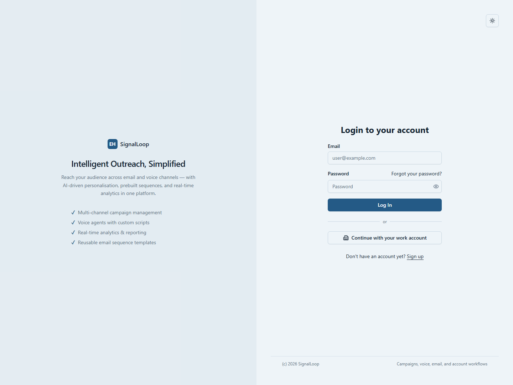

Steps:

1. Open the EngageHub URL in your browser.
2. If you are not already signed in, the app shows the Log In page.
3. Enter your email address in the Email field.
4. Enter your password in the Password field.
5. Select the eye icon if you need to briefly reveal or verify the password.
6. Select Log In.
7. After a successful login, EngageHub opens the Dashboard.

Helpful notes:

- Passwords must be at least 8 characters.
- If you mistype your email or password, correct the field and try again.
- The appearance button in the top-right corner changes the visual theme.

### Create an Account

Use Sign Up if you do not yet have an EngageHub account.

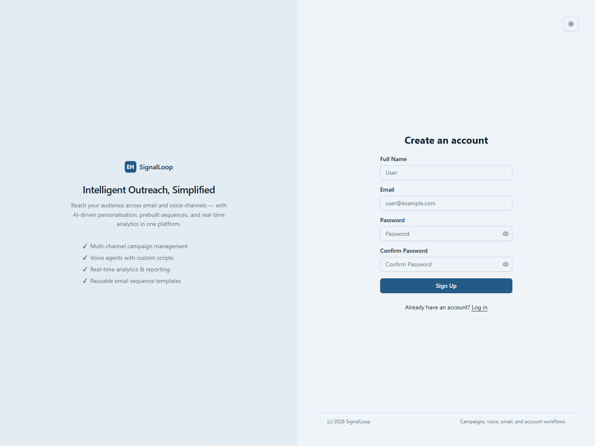

Steps:

1. From the Log In screen, select Sign up.
2. Enter your full name.
3. Enter your email address.
4. Enter a password with at least 8 characters.
5. Re-enter the same password in Confirm Password.
6. Select Sign Up.
7. After signup, return to the Log In page and sign in.

Good practice:

- Use your work email address so campaigns, audit events, and permissions are tied to your organization.
- If password confirmation fails, retype both password fields carefully.

### Recover a Password

Use Password Recovery if you forgot your password.

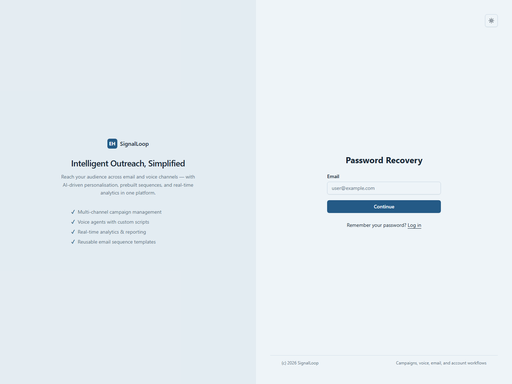

Steps:

1. From the Log In screen, select Forgot your password?.
2. Enter the email address for your EngageHub account.
3. Select Continue.
4. Check your inbox for the password recovery email.
5. Open the reset link in the email.
6. Enter and confirm your new password.
7. Return to Log In and sign in with the new password.

## 2. Understanding the Main Layout

After logging in, the app uses a consistent layout.

- The left sidebar is the main navigation area.
- The top-left logo returns you to the Dashboard.
- The sidebar can be collapsed with the button in the top header.
- The Appearance control changes between light, dark, and system theme.
- The account menu at the bottom of the sidebar shows the signed-in user.
- The main workspace on the right changes based on the selected feature.

Primary navigation items:

| Menu Item | Purpose |
| --- | --- |
| Dashboard | High-level overview and quick access to major workflows. |
| Campaigns | Guided campaign intake, audience selection from the existing Contacts lead pool, filtered subsets, offer-pack assignment, and strategy setup. |
| Sequences | Build and manage multi-step outreach flows. |
| Voice Agents | Configure Alex and Morgan voice agents, scripts, test calls, and shared knowledgebase files. |
| Contacts | Download the CSV template, analyze imports, map fields, preview rows, fix validation issues, import contacts, search the shared lead pool, and view timelines from selected contact links. |
| Customer 360 | Review one account's summary, contacts, cross-channel activity, open work, next best action, and unified timeline before follow-up. |
| Analytics | Review campaign performance, email rates, voice calls, and sequence funnel data. |
| Templates | Create reusable email templates, preview tokens, publish compliant versions. |
| Controls | Manage daily sending caps, quiet hours, and emergency pause/resume controls. |
| Settings | Update profile, password, and account preferences. |
| Providers | Administrator-only setup for active email, LLM, and speech-to-text providers. |

Administrators may also see Providers for workspace provider setup and Admin for user management.

## 3. Dashboard

The Dashboard is your starting point after login.

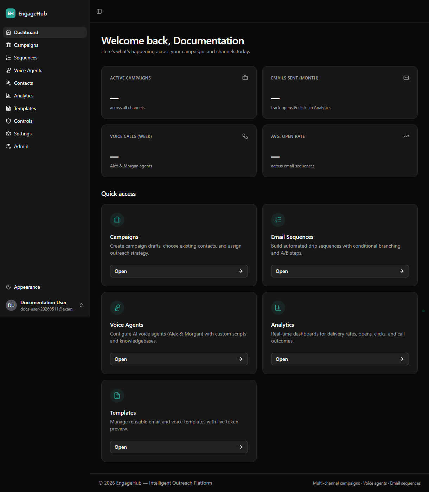

What you can do here:

- Check high-level campaign, email, voice, and open-rate summary cards.
- Open major feature areas using Quick access cards.
- Confirm the sidebar is available and your account is signed in.

Steps:

1. Select Dashboard from the sidebar.
2. Review the top summary cards:
   - Active Campaigns
   - Emails Sent (Month)
   - Voice Calls (Week)
   - Avg. Open Rate
3. Use Quick access cards to jump into Campaigns, Email Sequences, Voice Agents, Analytics, or Templates.
4. Use the sidebar when you need a specific feature directly.

Note: the Dashboard Campaigns card opens campaign intake. Contact import, field mapping, validation, and lead-pool management happen on Contacts.

When to use it:

- At the beginning of the day to orient yourself.
- Before launching new outreach to confirm you are in the right workspace.
- After completing setup to move into monitoring and analytics.

## 4. Campaign Intake

Campaigns is where you create a draft campaign, choose an audience from the shared Contacts lead pool, and assign the offer/channel strategy.

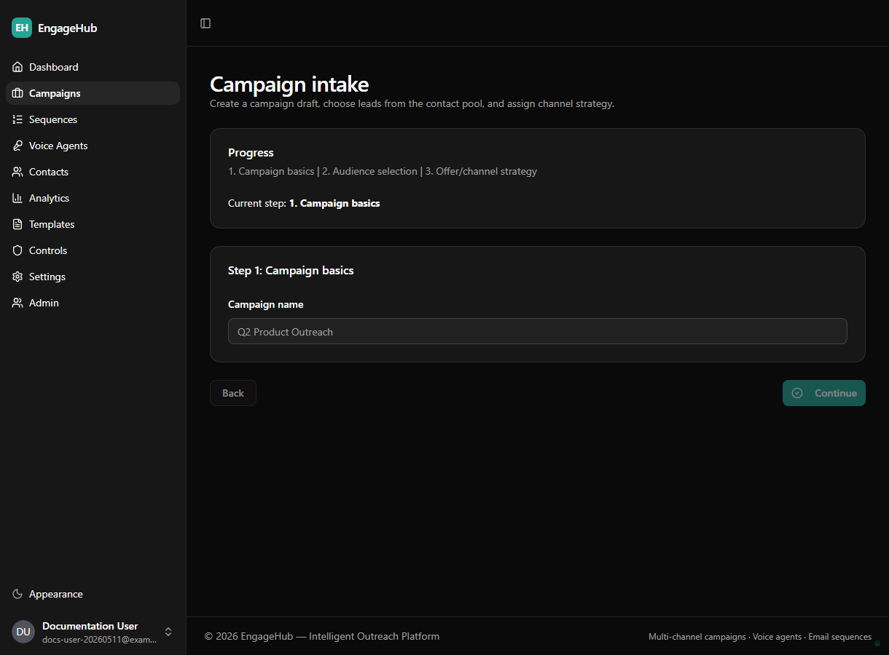

The Campaign intake workflow has three steps:

1. Campaign basics
2. Audience selection
3. Offer/channel strategy

Campaigns does not import CSV files or manage leads directly. Prepare and validate contacts on the Contacts page first, then return to Campaigns to select from that existing pool.

### Step 1: Campaign Basics

Steps:

1. Select Campaigns in the sidebar.
2. Enter a campaign name, such as `Q2 Product Outreach`.
3. Use a name that a teammate can understand later.
4. Select Continue.
5. EngageHub creates a draft campaign and moves you to audience selection.

Tips for campaign names:

- Include the audience or objective, such as `Healthcare Renewal Outreach`.
- Include timing when useful, such as `May Webinar Follow-up`.
- Avoid vague names like `Test` or `New Campaign` in shared workspaces.

### Step 2: Audience Selection

Campaigns use contacts that already exist in the shared lead pool. If the list is empty or missing people, go to Contacts and import or update the lead pool before continuing.

Steps:

1. Review the available contact count at the top of Step 2.
2. Search the lead pool if you need to find a specific person, company, email, phone, or timezone.
3. Choose All contacts, Selected contacts, or Filtered subset.
4. For Selected contacts, tick the leads to include.
5. For Filtered subset, enter a subset name and rule.
6. Choose a field such as `company`, `email`, `phone`, or `timezone`.
7. Choose an operator:
   - `equals`
   - `contains`
   - `startsWith`
   - `in-list`
8. Enter the value, such as `Technology`.
9. Select Continue.
10. EngageHub assigns the matching contacts to the campaign and moves to strategy setup.

Examples:

| Subset Goal | Field | Operator | Value |
| --- | --- | --- | --- |
| Target contacts at named companies | `company` | `in-list` | `Contoso,Fabrikam,Northwind` |
| Target a company family | `company` | `contains` | `Health` |
| Target local calling windows | `timezone` | `equals` | `America/New_York` |
| Target known phone contacts | `phone` | `startsWith` | `+1` |

### Step 3: Offer and Channel Strategy

Strategy controls which offer pack and channel behavior apply to the campaign.

Steps:

1. Choose a published offer pack version if one is available.
2. If you do not want to assign an offer pack, leave the field blank.
3. Review the Channel strategy JSON.
4. For an email-only campaign, use a simple strategy such as `{"channel":"email"}`.
5. For more advanced scenarios, define the channel structure your team supports.
6. Select Save strategy.
7. Confirm the success message appears.

Important:

- Only published and compliant template or offer-pack versions should be used for live campaigns.
- Ask an administrator or campaign owner before changing a shared strategy.
- Keep JSON valid. Missing quotes, commas, or braces can prevent the strategy from saving.

## 5. Sequences

Sequences are reusable multi-step outreach flows that combine emails, waits, and voice steps.

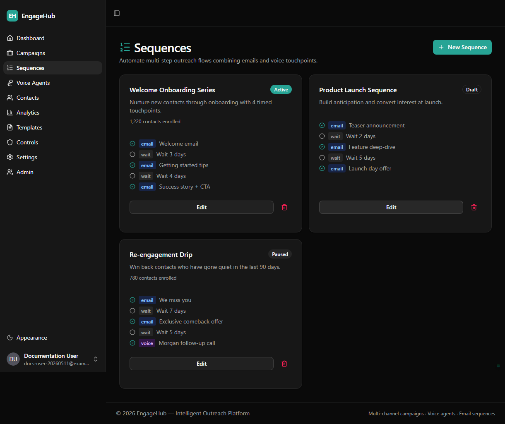

What you can do here:

- Review existing sequences.
- See whether a sequence is Active, Draft, or Paused.
- Understand each sequence step in order.
- Create a new draft sequence.
- Delete draft or unwanted sequences.

### Create a New Sequence

Steps:

1. Select Sequences in the sidebar.
2. Select New Sequence.
3. Enter a name, such as `Spring Promotion Series`.
4. Enter a short description.
5. Select Create.
6. The new sequence appears as a Draft.
7. Select Edit when you are ready to adjust the sequence details.

Sequence building tips:

- Start with one immediate email.
- Add waits between messages so contacts are not overwhelmed.
- Use a voice step only when a human-like follow-up is appropriate.
- Pause a sequence when content, compliance, or audience quality needs review.

### Read a Sequence Card

Each sequence card shows:

- Name and description.
- Status badge.
- Number of contacts enrolled, when available.
- Ordered steps, such as email, wait, and voice.
- Edit and delete actions.

## 6. Voice Agents

Voice Agents lets you choose, configure, and test AI voice outreach behavior.

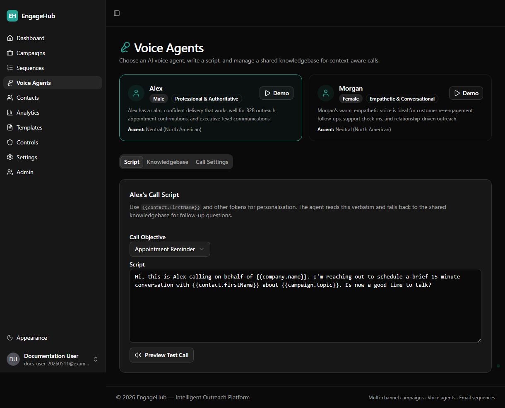

EngageHub includes two voice agents:

| Agent | Best For | Tone |
| --- | --- | --- |
| Alex | B2B outreach, appointment confirmations, executive communication | Professional and authoritative |
| Morgan | Re-engagement, follow-ups, support check-ins, relationship-driven outreach | Empathetic and conversational |

### Choose an Agent

Steps:

1. Select Voice Agents in the sidebar.
2. Review the Alex and Morgan cards.
3. Select the agent you want to configure.
4. Use Demo to hear a sample greeting.
5. Select Stop if you want to stop playback.

### Configure a Call Script

Steps:

1. Open the Script tab.
2. Choose a Call Objective:
   - Appointment Reminder
   - Follow-up Call
   - Re-engagement
   - Product Introduction
   - Feedback / Survey
   - Custom
3. Review the script text.
4. Edit the script to match your campaign.
5. Use personalization tokens such as `{{contact.firstName}}`, `{{company.name}}`, or `{{campaign.topic}}`.
6. Select Preview Test Call to initiate a preview test call flow.

Script writing tips:

- Keep the opening sentence short and clear.
- Mention who the agent represents.
- Ask one question at a time.
- Avoid jargon contacts will not recognize.
- Include a polite fallback if now is not a good time.

### Add Shared Knowledgebase Files

Knowledgebase files give Alex and Morgan additional context when contacts ask questions outside the script.

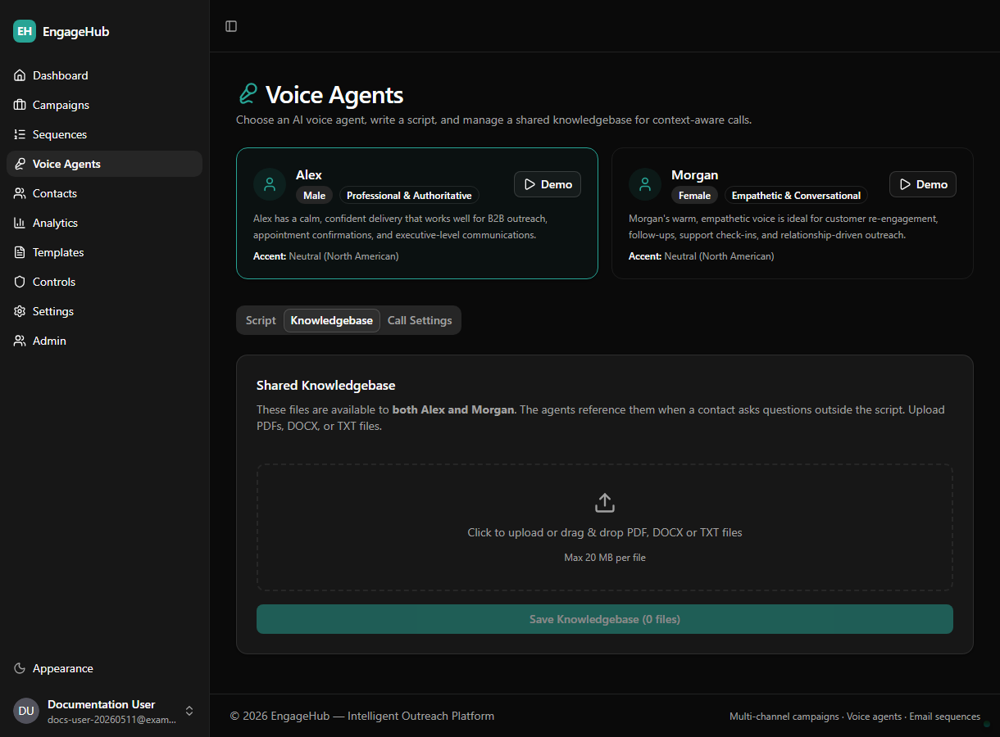

Steps:

1. Open the Knowledgebase tab.
2. Click the upload area.
3. Choose one or more PDF, DOCX, or TXT files.
4. Review the uploaded file list.
5. Remove any wrong file with the remove icon.
6. Select Save Knowledgebase.
7. Confirm the saved message appears.

Good files to upload:

- Product FAQ.
- Pricing overview.
- Appointment policies.
- Support escalation rules.
- Campaign-specific offer details.

Avoid uploading:

- Outdated policy documents.
- Internal-only confidential notes not approved for agent use.
- Files with conflicting instructions.

### Review Call Settings

The Call Settings tab describes advanced configuration for retry count, call windows, voicemail behavior, consent recording, and Do Not Call integration. These options depend on telephony provider setup.

## 7. Templates

Templates are reusable outreach messages. They support tokens so the same template can personalize content for each contact.

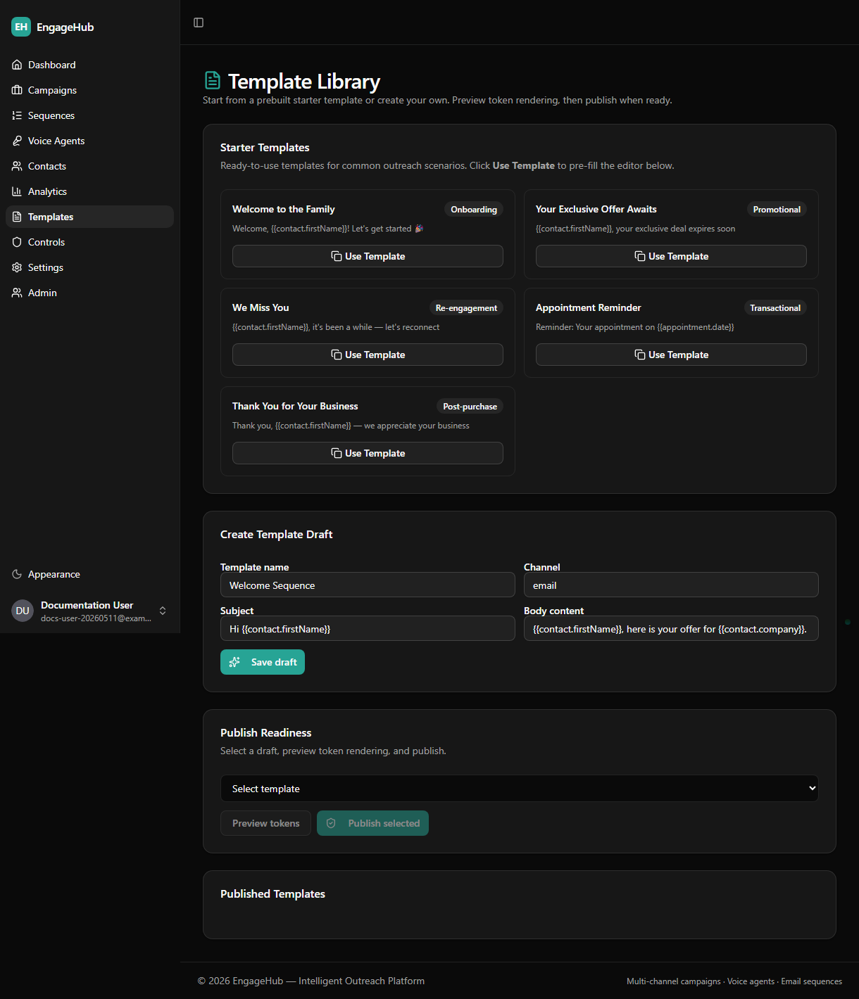

What you can do here:

- Start from prebuilt starter templates.
- Create custom email drafts.
- Preview token rendering.
- Publish selected templates after guardrail validation.
- Review published templates.

### Use a Starter Template

Steps:

1. Select Templates in the sidebar.
2. Review the Starter Templates section.
3. Choose a template that matches your use case, such as Welcome, Promotional, Re-engagement, Reminder, or Thank You.
4. Select Use Template.
5. The editor fields are prefilled.
6. Review and edit the subject and body.

### Create a Template Draft

Steps:

1. Enter a Template name.
2. Set Channel, usually `email`.
3. Enter the Subject.
4. Enter Body content.
5. Use tokens for personalization, such as:
   - `{{contact.firstName}}`
   - `{{contact.company}}`
   - `{{offer.expiryDate}}`
   - `{{sender.name}}`
6. Select Save draft.
7. Confirm the feedback message appears.

Writing tips:

- Put the most important message in the first paragraph.
- Use a clear call to action.
- Keep the subject specific and honest.
- Provide default token values where possible.

### Preview Tokens

Steps:

1. In Publish Readiness, choose a template from the dropdown.
2. Select Preview tokens.
3. Review the rendered preview.
4. Check for unresolved tokens.
5. If unresolved tokens appear, edit the template or token configuration.

### Publish a Template

Steps:

1. Select a draft template.
2. Preview tokens first.
3. Select Publish selected.
4. Wait for guardrail validation.
5. Confirm the template appears under Published Templates.

Important:

- Published templates are the safest versions to use in campaigns.
- Guardrail-compliant templates reduce the risk of invalid personalization or policy violations.

## 8. Analytics

Analytics helps you understand performance across campaigns, email sequences, and voice outreach.

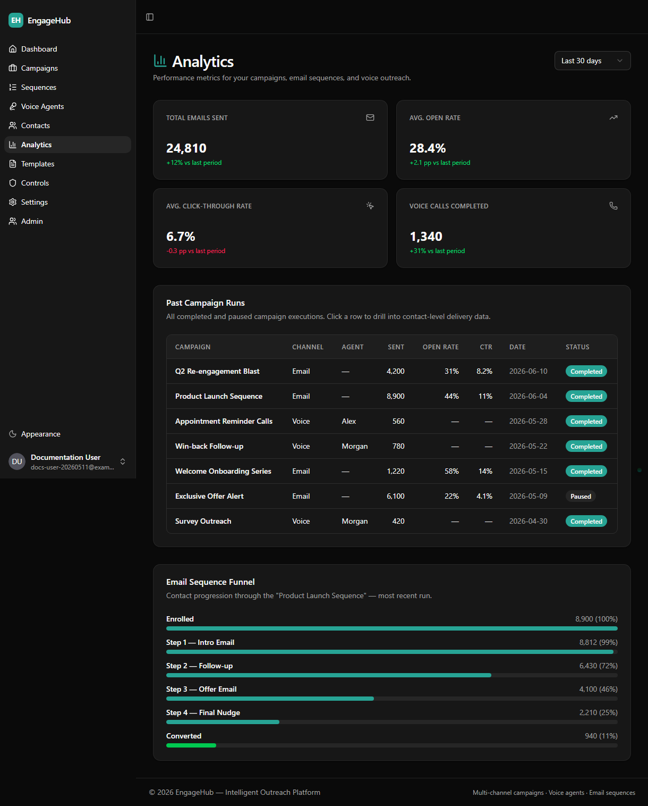

What you can do here:

- Change the reporting period.
- Review summary performance cards.
- Review past campaign runs.
- Compare email and voice performance.
- Inspect the sequence funnel.

### Change the Reporting Period

Steps:

1. Select Analytics in the sidebar.
2. Open the period dropdown in the top-right.
3. Choose Last 7 days, Last 30 days, Last 90 days, or Year to date.
4. Review updated metrics.

### Read Summary Cards

The top cards show:

- Total Emails Sent.
- Average Open Rate.
- Average Click-through Rate.
- Voice Calls Completed.

Each card includes a change indicator compared with the previous period.

### Review Past Campaign Runs

Steps:

1. Scroll to Past Campaign Runs.
2. Review campaign name, channel, assigned voice agent, sent count, open rate, click-through rate, date, and status.
3. Look for outliers, such as unusually low open rates or paused campaigns.
4. Use results to decide whether to adjust templates, segmentation, or send timing.

### Read the Sequence Funnel

The Email Sequence Funnel shows how many contacts reached each step.

Use it to answer questions like:

- How many contacts enrolled?
- Where did the largest drop-off occur?
- How many contacts converted?
- Should we revise the offer, timing, or final nudge?

## 9. Outreach Controls

Controls protects your sender reputation and gives administrators emergency stop/start capability.

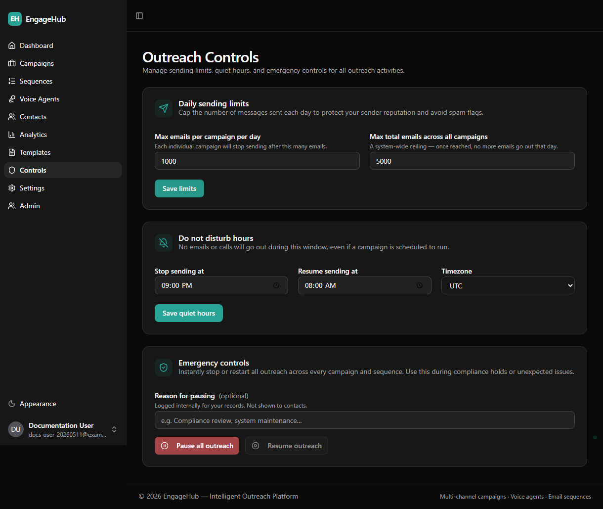

### Review Daily Sending Limits

Steps:

1. Select Controls in the sidebar.
2. Review the displayed daily sending limit state.
3. Use emergency pause if the current limits are not safe for the moment.

Guidance:

- Use conservative limits when warming a sender domain.
- Increase limits gradually as engagement and deliverability remain healthy.
- Use lower campaign-level caps for experimental campaigns.
- In the current app, daily-limit editing is not available on this page.

### Review Do Not Disturb Hours

Steps:

1. Review the displayed quiet-hours state.
2. If outreach needs to stop immediately, use Emergency controls.

How quiet hours work:

- No emails or calls go out during the configured window.
- Scheduled campaigns wait until sending resumes.
- This protects recipients from late-night or inappropriate outreach.
- In the current app, quiet-hour editing is not available on this page.

### Pause or Resume All Outreach

Emergency controls stop or restart outreach across every campaign and sequence.

Steps to pause:

1. Scroll to Emergency controls.
2. Enter a reason, such as `Compliance review` or `System maintenance`.
3. Select Pause all outreach.
4. Confirm the paused banner or feedback message appears.
5. Notify campaign owners that sending has stopped.

Steps to resume:

1. Return to Emergency controls.
2. Confirm the reason for the pause has been resolved.
3. Select Resume outreach.
4. Confirm the feedback message appears.
5. Monitor campaigns and analytics after resuming.

Use emergency pause when:

- A compliance issue is being investigated.
- A template mistake was discovered after launch.
- Provider errors are affecting sending.
- The wrong contacts or subset were assigned.
- Your organization needs an immediate temporary hold.

## 10. Contacts and Timeline

Contacts is the shared lead pool for EngageHub. Add leads here before creating campaigns so the same contacts can be reused across outreach efforts.

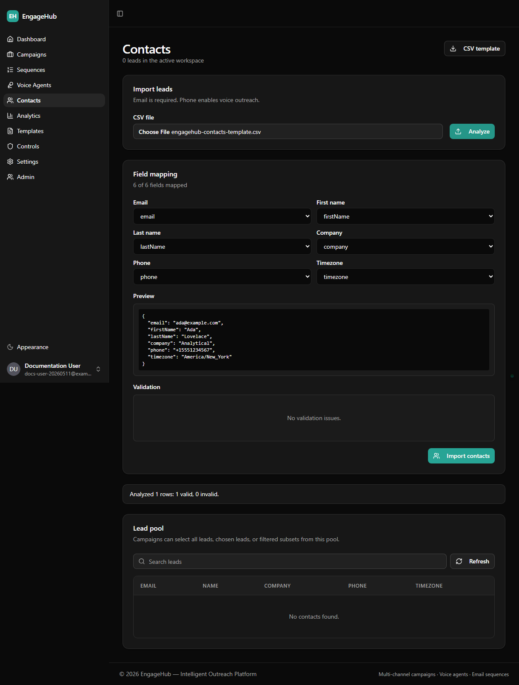

When no contact is selected, the page shows import, mapping, search, and lead list controls.

What you can do here:

- Download the CSV template.
- Analyze a CSV before saving it.
- Map incoming columns to EngageHub fields.
- Preview valid rows.
- Review row-level validation issues.
- Import valid contacts into the shared lead pool.
- Search and refresh the lead table.
- Confirm email, name, company, phone, and timezone values before campaign selection.

### Import Leads

Steps:

1. Select Contacts in the sidebar.
2. Select CSV template if you need the expected columns.
3. Choose a `.csv` file.
4. Select Analyze.
5. Review the analysis summary, including total rows, valid rows, and invalid rows.
6. Map source columns to EngageHub fields such as `email`, `firstName`, `lastName`, `company`, `phone`, and `timezone`.
7. Review the Preview panel for valid rows.
8. Review the Validation panel for row-level issues.
9. Select Import contacts when email is mapped and validation is acceptable.
10. Confirm the feedback message and lead pool table update.

Recommended CSV fields:

| Field | Why It Matters |
| --- | --- |
| `email` | Required for email outreach and deduplication. |
| `firstName` | Used for personalization tokens. |
| `lastName` | Helps sales and support teams identify contacts. |
| `company` | Used in templates, scripts, and filtered campaign subsets. |
| `phone` | Required for voice outreach. |
| `timezone` | Helps schedule sends and calls at appropriate local times. |

### Search Leads

Steps:

1. Enter an email, name, company, or phone value in Search leads.
2. Select Refresh or press Enter.
3. Review matching leads in the Lead pool table.
4. Clear or change the search text and refresh again to return to the wider pool.

When a contact is selected, the timeline can show:

- State transitions.
- Emails sent.
- Email opens.
- Call sessions.
- Signals.
- Booking events.
- Routing events.

### View a Contact Timeline

Steps:

1. From the Lead pool table, select a contact row (or select the contact name link).
2. The right-hand panel switches to the contact's timeline view.
3. Review the contact's identity card at the top: name, email, company, phone, and timezone.
4. Scroll the timeline to see chronological events, newest first by default.
5. Use the event-type filter (when available) to narrow to a specific stream, such as Emails sent or Call sessions.
6. Select an event entry to expand details such as subject line, template version, call duration, or routing decision.
7. Use the Back or Close action in the panel header to return to the lead pool view.

Reading the timeline:

| Event Type | What It Means |
| --- | --- |
| State transition | The contact moved between progression states (for example, Enrolled → Contacted → Engaged). |
| Email sent | An outbound email was dispatched. The entry records template, subject, and send time. |
| Email open | A tracked open was recorded for a previously sent email. |
| Call session | A voice call was attempted or completed. The entry records the agent, duration, and outcome. |
| Signal | A behavioural signal such as a click, reply, or unsubscribe was captured. |
| Booking event | A meeting or appointment was scheduled or updated. |
| Routing event | The contact was rerouted between sequences, owners, or workspaces. |

When to use the timeline:

- Before a manual follow-up call, to see what the contact has already received.
- During QA, to confirm a campaign step was actually delivered.
- During investigation, when a contact reports unexpected outreach or wants to opt out.
- During analytics review, to verify a funnel drop-off is reflected at the individual level.

## Customer 360

Customer 360 is the account-level workspace for a company. It shows the account summary, contacts, chatbot activity, email sequence activity, voice call activity, prospecting research, open work, next best action, and unified account timeline.

Use Customer 360 before follow-up when you need to understand what has happened across every channel for one account.

## 11. Settings and Profile

Settings is where you manage your personal account information.

What you can do here:

- Update your display name.
- Update the email address associated with your account.
- Change your password.
- Adjust appearance preferences (light, dark, or system).

### Update Your Profile

Steps:

1. Select Settings in the sidebar (or open the account menu at the bottom of the sidebar).
2. Edit your full name.
3. Edit your email address if it has changed.
4. Select Save.
5. Confirm the success message appears.

### Change Your Password

Steps:

1. Open Settings.
2. Open the Change password section.
3. Enter your current password.
4. Enter a new password of at least 8 characters.
5. Confirm the new password.
6. Select Update password.
7. Sign in again on the next session.

Good practice:

- Use a unique password not reused on other systems.
- Rotate the password if you suspect it has been shared.
- Notify an administrator if you can no longer sign in and password recovery does not arrive.

## 12. Provider Setup (Administrators)

Provider Setup is available to superusers. It controls which providers the current workspace uses for email, LLM, and speech-to-text.

What you can do here:

- Review the active provider for Email, LLM, and STT.
- Choose local providers for local demo work.
- Choose managed providers after credentials have been added through the API.
- Refresh or test that the provider-options API is responding.

Local demo selections:

| Capability | Provider |
| --- | --- |
| Email | SMTP / Mailpit |
| LLM | Ollama |
| STT | Faster Whisper Local |

Steps:

1. Sign in as a superuser.
2. Select Providers in the sidebar.
3. Review the Workspace badge to confirm you are editing the right workspace.
4. Choose a provider from each dropdown.
5. Confirm the status badge shows Local for local demo providers or Managed for hosted providers.
6. Select Test to confirm the provider-options API is responding.

Notes:

- Provider Setup does not collect API keys or secrets.
- If a provider requires credentials, add them through the provider credentials API before selecting it for real delivery.
- If you do not see Providers, your account does not have superuser permissions.

## 13. Sign Out

Sign out when you are done for the day, when switching accounts, or when working on a shared computer.

Steps:

1. Open the account menu at the bottom of the sidebar.
2. Select Sign out.
3. The app returns to the Log In page.

## 14. Where to Get Help

If something does not behave as described in this guide:

1. Confirm the app version and the URL you are using.
2. Re-check the relevant step in this guide.
3. Note any error message exactly as displayed.
4. Contact your EngageHub administrator or platform owner with the campaign name, contact involved (if any), and the time of the issue.
5. For development-environment issues, point your engineer at the runbooks under `docs/runbooks/` and the developer onboarding material under `docs/developer-guide/`.

## Glossary

| Term | Meaning |
| --- | --- |
| Campaign | A named outreach effort with an audience, offer, and channel strategy. |
| Sequence | A reusable multi-step flow combining emails, waits, and voice steps. |
| Template | A reusable email message with personalization tokens. |
| Token | A placeholder such as `{{contact.firstName}}` that is replaced at send time. |
| Offer pack | A published, versioned bundle of offer content used by a campaign. |
| Lead pool | The shared list of contacts available for selection by any campaign. |
| Voice agent | An AI voice persona (Alex or Morgan) that places outbound calls. |
| Knowledgebase | Files supplied to voice agents for context beyond the script. |
| Quiet hours | A configured window where no outreach is sent. |
| Emergency pause | An administrator action that immediately halts all outreach. |
| Workspace | The tenant boundary that scopes campaigns, contacts, and audit events. |

1. Open a contact from a drilldown link when one is available.
2. Confirm the Contact Timeline page opens.
3. Review the total number of recorded events.
4. Use Event type filters to narrow the timeline.
5. Set From and To dates if you only want a specific period.
6. Select an event card to open event details.
7. Review audit metadata, channel, outcome, reason codes, explanations, transcripts, or signal summaries when available.
8. Use Load more if additional events are available.
9. Select Reset to clear filters.

Timeline filter examples:

| Goal | Filter |
| --- | --- |
| See only calls | Select Call. |
| Investigate booking behavior | Select Booking. |
| Audit automation decisions | Select State, Signal, and Routing. |
| Review recent outreach only | Set a From date for the current week. |

## 11. Settings

Settings lets each user manage their own account.

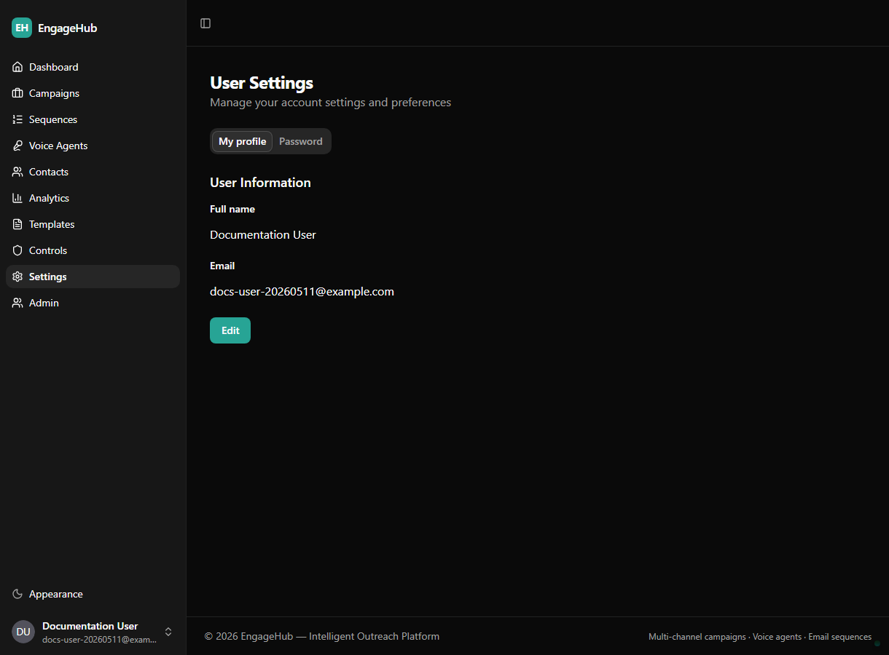

Available tabs:

- My profile
- Password
- Danger zone

### Edit Profile Information

Steps:

1. Select Settings in the sidebar.
2. Open My profile.
3. Review your full name and email.
4. Select Edit.
5. Update your full name or email.
6. Select Save.
7. Confirm the success message appears.

Notes:

- Use a recognizable full name so audit logs and user lists are easy for teammates to understand.
- Changing an email may affect future login behavior.

### Change Password

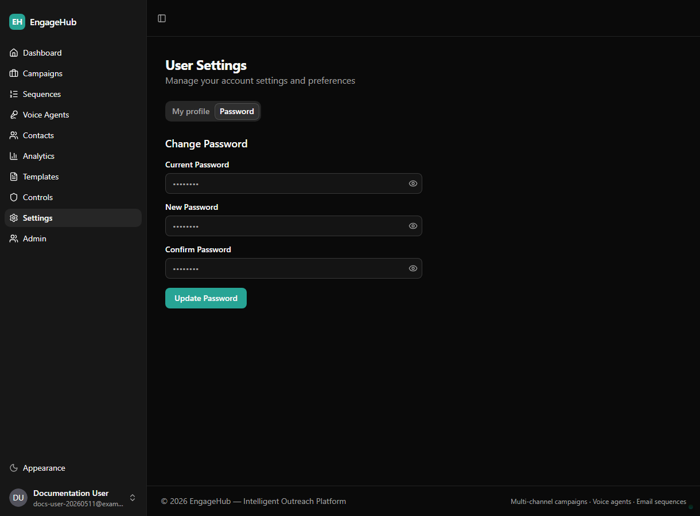

Steps:

1. Select Settings in the sidebar.
2. Open the Password tab.
3. Enter your current password.
4. Enter your new password.
5. Confirm the new password.
6. Select Update Password.
7. Confirm the success message appears.
8. Use the new password next time you log in.

Password rules:

- Password must be at least 8 characters.
- New Password and Confirm Password must match.

### Delete Account

The Danger zone tab contains account deletion controls.

Steps:

1. Select Settings.
2. Open Danger zone.
3. Read the warning carefully.
4. Start the delete confirmation only if you are certain.
5. Confirm account deletion when prompted.

Warning:

- Account deletion is permanent.
- Do not delete an account that owns active campaigns without first transferring responsibility or confirming with an administrator.

## 12. Admin User Management

Some users may see Providers and Admin menu items. Both are available only to superusers.

Admins can typically:

- Select workspace providers for email, LLM, and STT from Providers.
- View users.
- Add users.
- Manage permissions.
- Review whether a listed user is the current user.

Basic steps:

1. Select Admin in the sidebar.
2. Review the users table.
3. Select Add User to create a new account.
4. Enter required user details.
5. Save the user.
6. Confirm the user appears in the table.

If you do not see Providers or Admin, your account does not have superuser permissions.

## 13. Recommended First Campaign Workflow

Follow this end-to-end workflow when launching your first campaign.

1. Prepare templates.
   - Go to Templates.
   - Use a starter template or create a draft.
   - Preview tokens.
   - Publish the selected template.
2. Prepare voice behavior if calls are included.
   - Go to Voice Agents.
   - Select Alex or Morgan.
   - Review the call script.
   - Upload relevant knowledgebase files.
   - Run a preview test call if available.
3. Confirm provider setup if you are an administrator.
   - Go to Providers.
   - Confirm local or managed providers are selected for Email, LLM, and STT.
4. Configure safety controls.
   - Go to Controls.
   - Review daily sending limits and quiet hours.
   - Use emergency pause/resume if an operational hold is needed.
5. Prepare contacts.
   - Go to Contacts.
   - Download the CSV template if needed.
   - Analyze the lead CSV.
   - Map email, name, company, phone, and timezone fields.
   - Review preview rows and validation issues.
   - Import the contacts into the shared lead pool.
6. Create the campaign.
   - Go to Campaigns.
   - Enter a clear campaign name.
   - Choose all contacts, selected contacts, or a filtered subset from the existing lead pool.
   - Save the channel strategy.
7. Monitor performance.
   - Go to Analytics.
   - Review campaign run metrics.
   - Watch open rate, click-through rate, completed calls, and funnel conversion.
8. Investigate contacts when needed.
   - Open contact timelines from available drilldown links.
   - Filter events by type or date.
   - Review reason codes and transcripts where available.
9. Pause if something looks wrong.
   - Go to Controls.
   - Enter a pause reason.
   - Select Pause all outreach.

## 14. Troubleshooting

### I cannot log in

Try this:

1. Confirm you are using the correct email address.
2. Re-enter your password.
3. Use Forgot your password? if needed.
4. Ask an administrator to confirm your account exists.

### The Campaign Continue button is disabled

Common causes:

- Step 1 requires a campaign name longer than 2 characters.
- Step 2 requires at least one available contact for All contacts.
- Step 2 requires at least one picked contact for Selected contacts.
- Step 2 requires a filter value for Filtered subset.
- Step 3 requires valid channel strategy text.

If no contacts are available, go to Contacts, import or refresh the lead pool, and then return to Campaigns.

### My contact CSV has invalid rows

Try this:

1. Check required fields like email.
2. Remove blank rows.
3. Confirm column headers are present.
4. Check for invalid email addresses.
5. Analyze the corrected file again from Contacts.

### Token preview shows unresolved tokens

Try this:

1. Confirm the token name is spelled correctly.
2. Confirm the token exists in the sample payload or contact data.
3. Add a default value where supported.
4. Preview again before publishing.

### Voice demo does not play

Try this:

1. Confirm browser audio is not muted.
2. Wait a moment for speech voices to load.
3. Try a different browser if local speech synthesis is unavailable.
4. Select Demo again.

### Outreach needs to stop immediately

Use Controls:

1. Open Controls.
2. Scroll to Emergency controls.
3. Enter a reason.
4. Select Pause all outreach.
5. Confirm sending is paused.

## 15. Glossary

| Term | Meaning |
| --- | --- |
| Campaign | A planned outreach effort for a defined audience and goal. |
| Sequence | A reusable multi-step outreach flow. |
| Template | A reusable message body with personalization tokens. |
| Token | A placeholder like `{{contact.firstName}}` replaced with real contact data. |
| Segment | A subset of the audience selected by rules. |
| Channel strategy | Configuration that defines whether outreach uses email, voice, or another supported channel pattern. |
| Offer pack | A reusable bundle of approved offer and template assets. |
| Quiet hours | A time window when EngageHub should not send emails or make calls. |
| Emergency pause | A control that stops all outreach until resumed. |
| Contact timeline | A chronological record of events for one contact. |
| Guardrail validation | A safety check before publishing templates or outreach assets. |

## 16. Print and Share

This guide is available in three forms in this folder:

- `getting-started.md` for editing in Markdown.
- `getting-started.html` for browser viewing and printing.
- `EngageHub-Getting-Started-User-Guide.pdf` for sharing as a printable document.

When printing from the HTML version:

1. Open `getting-started.html` in a browser.
2. Press `Ctrl+P`.
3. Choose Save as PDF or a physical printer.
4. Enable background graphics if your browser offers that option.
5. Print or save.
